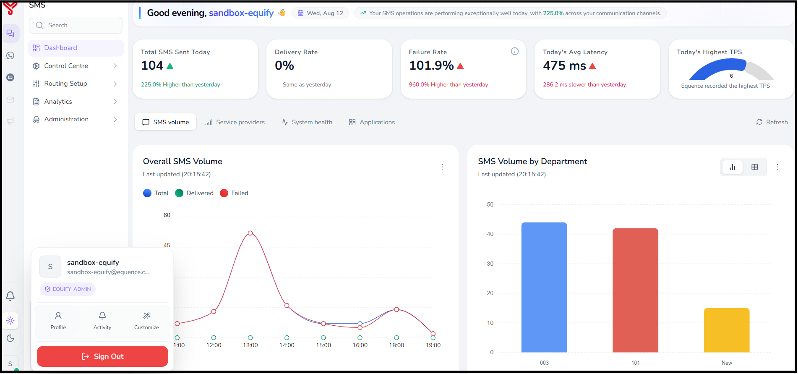
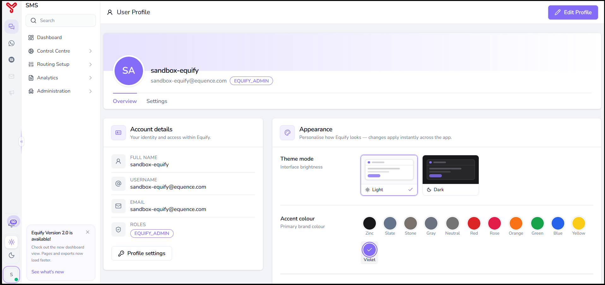
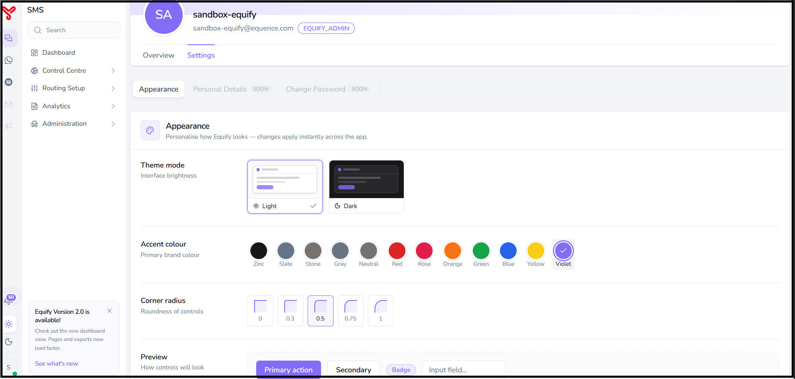
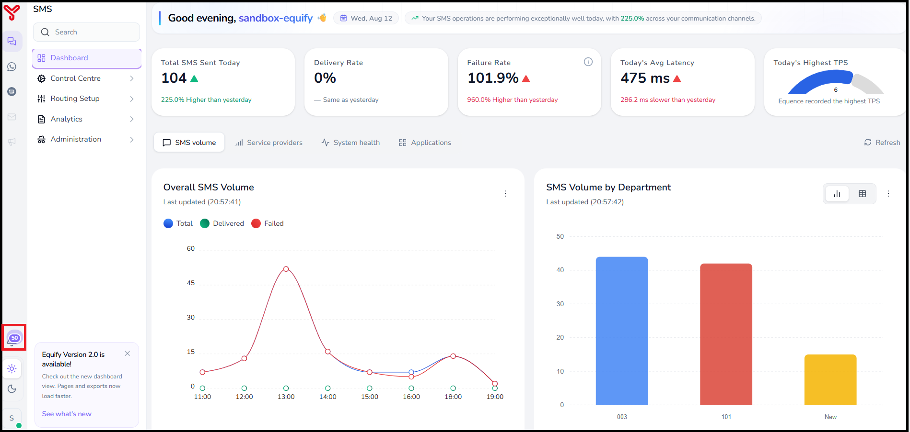
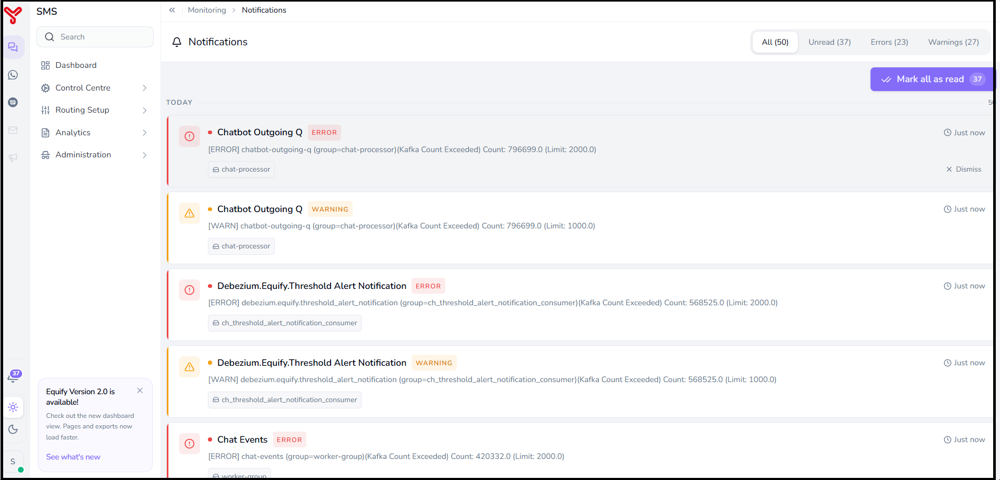
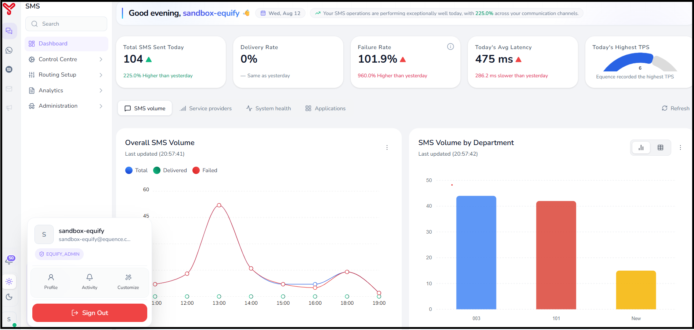

# User settings and notifications

---

This section describes how to access and manage user settings and notifications in Equify.

---

## User settings

User settings allow you to view account information and customize the application appearance.

---

### Access user settings

1. In the **bottom-left corner** of the application, select the **Profile icon**.
2. Select **Profile**.

  

---

### Profile overview

The **Overview** section displays your account details:

- Full name  
- Username  
- Email address  
- Assigned role  

  

---

### Appearance and personalization

The **Settings** section allows you to customize the application interface.

- **Theme mode** – Select Light or Dark mode  
- **Accent color** – Choose a primary interface color  
- **Corner radius** – Adjust the roundness of UI elements  
- **Preview** – View changes before applying  

Changes are applied immediately across the application.

---

### Additional actions

From the profile panel, you can also access:

- **Activity** – View system activity and events  
- **Customize** – Modify UI preferences  

---

## Notifications

Notifications provide real-time updates on system events and application activity.

---

### Access notifications

1. In the **bottom-left corner**, select the **Notifications icon**.
2. Review the alerts displayed in the panel.

---

### Notification details

The notification panel provides:

- Total notifications and unread count  
- Severity levels (for example, **Error**, **Warning**)  
- Message details, including source and timestamp  
- Status of system components (for example, queues and processors)  

Notifications are updated in real time to help monitor system health and activity.

---

---

## Sign out

Use the sign-out option to securely exit the application.

---

### Sign out

1. Select the **Profile icon**.
2. Select **Sign Out**.

The system ends your session and redirects you to the login page.

---

---

## Notes

- Review notifications regularly to monitor system health.  
- User interface preferences are user-specific and do not affect other users.

  

    <h2 class="support-title">Need some help?</h2>
    

      Communication at scale isn’t always simple. Get instant help from our
      <a href="https://equence.com/contact.html">support team</a>, or browse the
      <a href="../../faq/#faq">FAQ</a> for quick answers.
    

    

      <a href="https://equence.com/terms.html">Terms of service</a>
      <a href="https://equence.com/privacy-policy.html">Privacy Policy</a>
      © 2026 Equify. All rights reserved.
    

  

  

    

      
🎧

      
💬

      
🛡️

    

  

