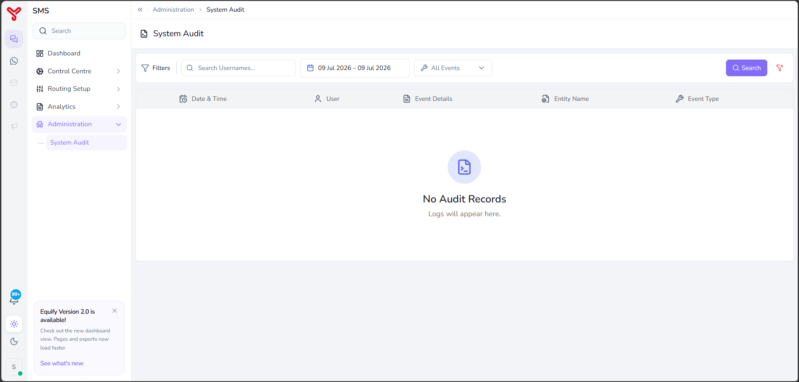

# System audit

---

The **System Audit** page provides a centralized view of user activities and system events recorded within Equify. Use this page to monitor configuration changes, review user actions, and investigate operational activities across the platform.

---

## Open system audit

1. In the left navigation pane, select **Administration**.
2. Select **System Audit**.

    

The **System Audit** page opens and displays audit records that match the selected filters.

---

## Search audit records

This procedure describes the steps to narrow the audit records displayed on the page.

#### Filter options

| Filter | Description |
|----------|-------------|
| **Username** | Search audit records for a specific user. |
| **Date Range** | Specify the start and end dates for the audit search. |
| **Event Type** | Filter records by event category, such as **CREATE**, **UPDATE**, or **DELETE**. |

1. Enter a username in the **Username** field, if required.
2. Select a **Date Range**.
3. Select an **Event Type**.
4. Select **Search**.

The system displays audit records that match the specified criteria.

!!! Note
    Select the **Clear Filters** to clear all filter value and restore the default view.

---

## Related articles

- [Administration overview](index.md)
- [Analytics](../analytics/index.md)