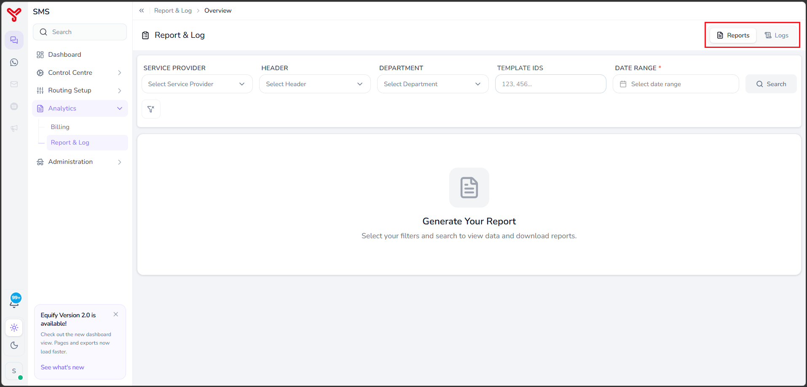
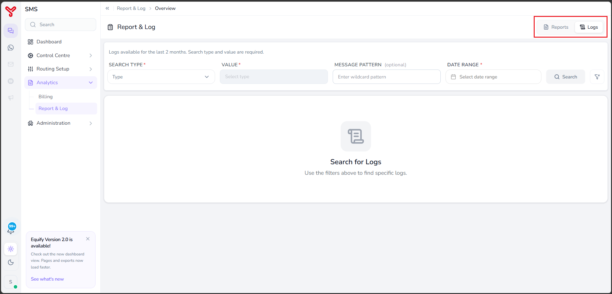

# Report & log

---

The **Report & Log** page provides access to reporting and log search capabilities. Use this page to generate message delivery reports, analyze messaging activity, and investigate message processing logs.

---

## Before you begin

Ensure that:

- The required reporting data is available for the selected date range.
- You know the search criteria required for the report or log query.

---

## Generate a report

This procedure describes the steps to generate and download message reports based on selected filters.

1. Navigate to **Analytics** > **Report & Log**.
2. Select the **Reports** tab.

    

3. Configure one or more filters:

    | Field | Description |
    |---------|-------------|
    | **Service Provider** | Select the service provider. |
    | **Header** | Select the sender header. |
    | **Department** | Select the department. |
    | **Template IDs** | Enter one or more template IDs. |
    | **Date Range** | Select the reporting period. |

4. Click **Search**.

    The system displays report data that matches the selected criteria.

5. Download the report if required.

!!! Note
    The **Date Range** field is mandatory for report generation.

!!! Tip
    Apply additional filters to reduce the volume of returned data and improve report accuracy.

---

## Search logs

This procedure describes the steps to search message transaction logs for troubleshooting and auditing purposes.

1. Navigate to **Analytics** > **Report & Log**.
2. Select the **Logs** tab.

    

3. Select a value from **Search Type**.
4. Enter the corresponding value in the **Value** field.
5. (Optional) Enter a pattern in **MESSAGE PATTERN**.
6. Select a **Date Range**.
7. Click **Search**.

The system displays log entries that match the specified search criteria.

!!! Note
    Both **Search Type** and **Value** are required.

!!! Note
    Log data is available for the previous two months only.

!!! Tip
    Use **MESSAGE PATTERN** when searching for messages that contain specific content or patterns.

---

## Related articles

- [Analytics overview](index.md)
- [Error control center](../control-centre/error-retry-management.md)

  

    <h2 class="support-title">Need some help?</h2>
    

      Communication at scale isn’t always simple. Get instant help from our
      <a href="https://equence.com/contact.html">support team</a>, or browse the
      <a href="../../../faq/#faq">FAQ</a> for quick answers.
    

    

      <a href="https://equence.com/terms.html">Terms of service</a>
      <a href="https://equence.com/privacy-policy.html">Privacy Policy</a>
      © 2026 Equify. All rights reserved.
    

  

  

    

      
🎧

      
💬

      
🛡️

    

  

