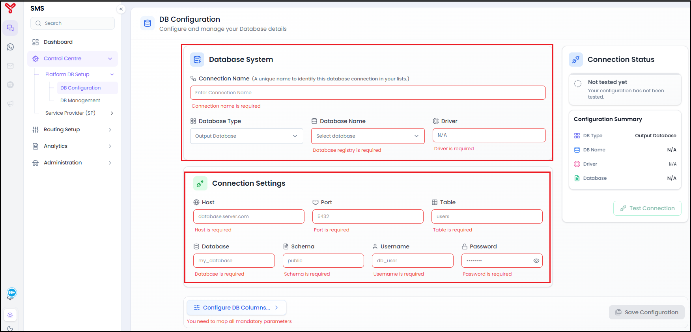
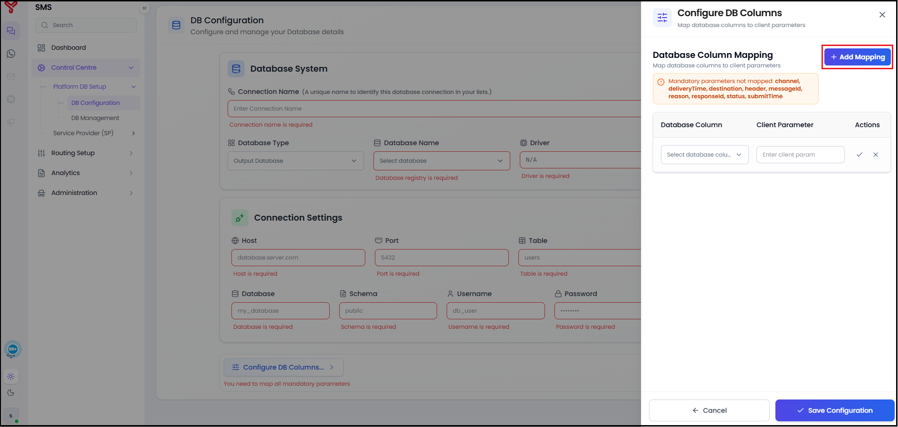
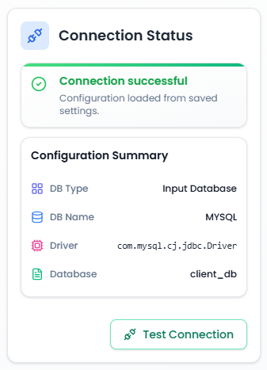

# Configure a Database Connection

The **DB Configuration** feature is used to connect a client database to the Equify SMS platform. After the connection is configured, Equify can read message records from the database and process them through the SMS delivery workflow.

## Before you begin

Make sure you have the following information:

- Database server hostname or IP address
- Port number
- Database name
- Schema name
- Table name
- Database username and password
- Database columns that contain SMS-related data

## Create a Database Configuration

1. Navigate to **Control Centre > Platform DB Setup > DB Configuration**.

2. In the **Database System** section, enter the connection details.

    | Field | Description |
    |---------|-------------|
    | **Connection Name** | A unique name for the database connection. |
    | **Database Type** | Select the database role: **Input Database** or **Output Database**. |
    | **Database Name** | Select the registered database. |
    | **Driver** | Displays the database driver associated with the selected database. This field is populated automatically. |

    !!! note

        **Input Database** – Equify reads outbound SMS requests from the database.

        **Output Database** – Equify writes delivery status information and delivery reports back to the database.

3. In the **Connection Settings** section, provide the database connection information.

    | Field | Description |
   |---------|-------------|
   | **Host** | Database server hostname or IP address. |
   | **Port** | Database listener port. |
   | **Table** | Database table used by Equify. |
   | **Database** | Database name. |
   | **Schema** | Database schema name. |
   | **Username** | Database user account. |
   | **Password** | Password for the database user account. |

    

    *Figure 1. Enter database and connection details.*

4. Select **Configure DB Columns**.

5. In the **Configure DB Columns** panel, map database columns to the corresponding client parameters.

6. Select **Add Mapping**.

    

    *Figure 2. Map database columns to client parameters.*

7. For each required parameter:
   
    a. Select the database column from the **Database Column** list.  
    b. Enter the corresponding client parameter in the **Client Parameter** field.  
    c. Save the mapping.

8. Continue adding mappings until all mandatory parameters are mapped.

    !!! note

        The platform displays a warning message for any required parameters that have not been mapped.

9. Select **Save Configuration** in the **Configure DB Columns** panel.

    The mappings are saved and the **DB Configuration** page is displayed.

10. Select **Test Connection**.

11. Wait for the validation process to complete.

12. Verify that the **Connection Status** panel shows a successful connection.

    !!! note

        If the test fails, review the connection details and database credentials before testing again.
    { width="300" }

    *Figure 3. Connection successful status.*

13. Select **Save Configuration**.

14. Verify that the new database configuration appears in the configured database list.

    The database connection is now available for use by the Equify.