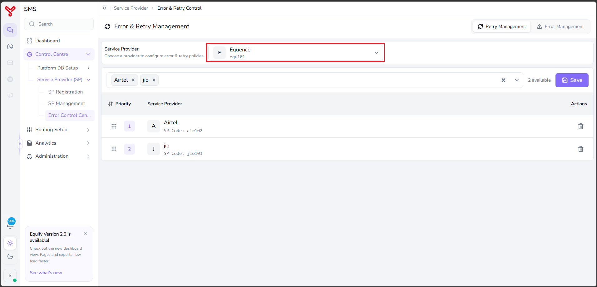
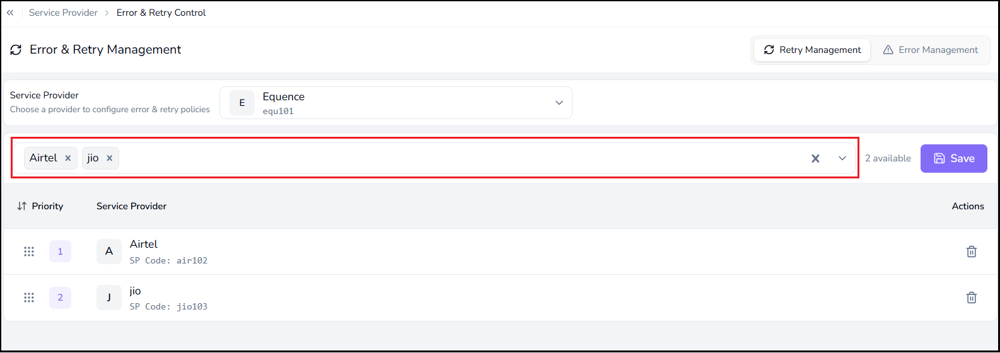

# Configure Retry Management

---

User can use **Retry Management** to define fallback service providers that Equify uses when message delivery through the primary service provider fails.

---

## Before you begin

Ensure that:

* The primary service provider is registered.
* One or more fallback service providers are registered.

---

## Select a service provider

Before configuring retry settings, select the service provider that you want to manage.

1. Navigate to **Control Centre > Service Provider (SP) > Error & Retry Control**.
2. Select the **Retry Management** tab.
3. Select a service provider from the **Service Provider** dropdown.

    

The selected provider becomes the active provider for configuration.

!!! note
    All retry settings apply only to the currently selected service provider. Each service provider can have its own retry configuration and fallback routing sequence.

---

## Configure retry management

1. Select one or more fallback service providers from the provider selection field.

    

    The selected providers are displayed in the retry list.

2. Arrange the retry order by dragging and dropping providers using the drag handle in the **Priority** column.

    * Priority **1** is the first fallback provider.
    * Priority **2** is the second fallback provider.
    * Additional providers are used in the configured order.

3. To remove a provider from the retry sequence, click the **Delete** icon in the **Actions** column.

4. Click **Save**.

The retry configuration is saved.

When message delivery fails through the primary service provider, Equify attempts delivery using the configured fallback providers according to the defined priority order.

!!! note
    Equify processes retry attempts sequentially based on the configured priority order.

---

## What to do next

- Configure error management in [configure error management](error_manage.md)
- Review system logs in [Analytics](../analytics/index.md)
- Optimize routing in [Routing Setup](../routing-setup/index.md)

  

    <h2 class="support-title">Need some help?</h2>
    

      Communication at scale isn’t always simple. Get instant help from our
      <a href="https://equence.com/contact.html">support team</a>, or browse the
      <a href="../../../faq/#faq">FAQ</a> for quick answers.
    

    

      <a href="https://equence.com/terms.html">Terms of service</a>
      <a href="https://equence.com/privacy-policy.html">Privacy Policy</a>
      © 2026 Equify. All rights reserved.
    

  

  

    

      
🎧

      
💬

      
🛡️

    

  

