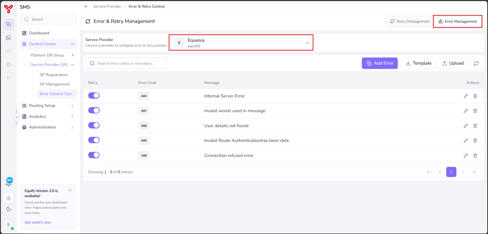
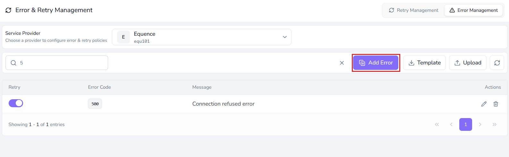
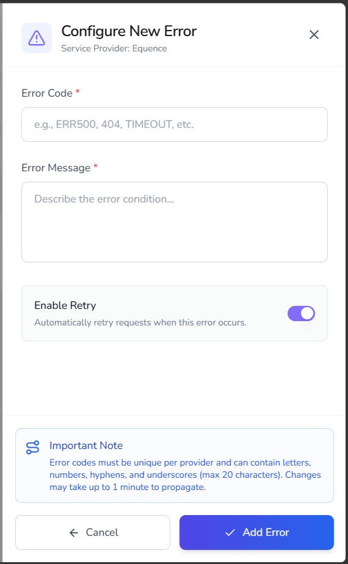
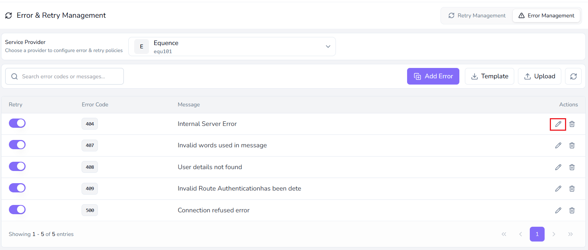
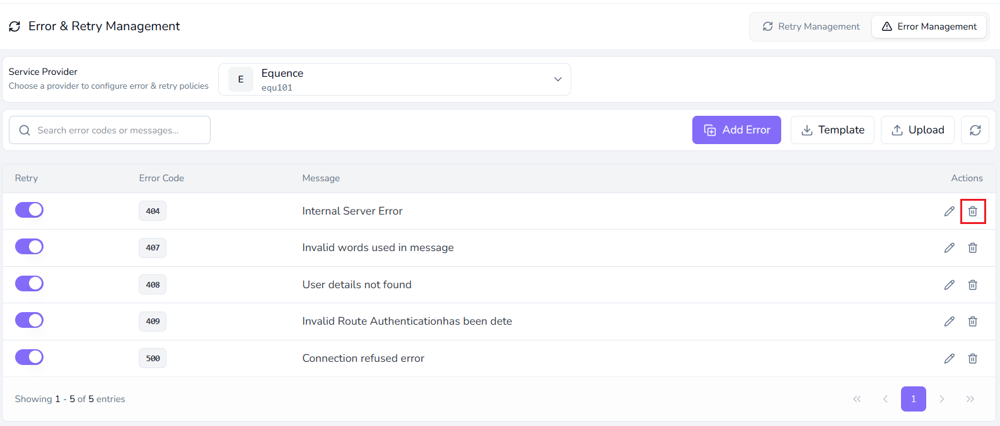
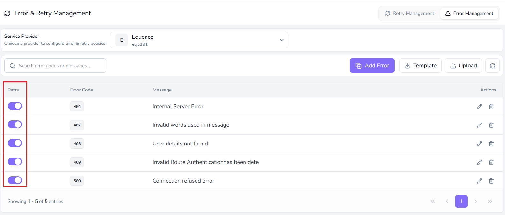
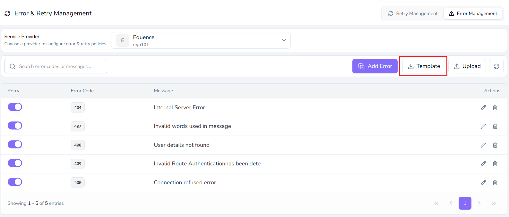

# Configure error management

---

User can use **Error Management** to define provider error codes and specify whether Equify should retry message delivery when those errors occur.

---

## Before you begin

Ensure that:

* A service provider is registered.
* You have the error codes and error messages provided by the service provider.

---

## About error management

The **Error Management** tab allows you to teach Equify how to interpret error responses returned by a service provider.

When a provider API returns an error code, Equify checks the configured error mappings to determine how the error should be handled.

For each configured error code, you can:

* Define the provider-specific error code.
* Define the corresponding error message.
* Specify whether the error should trigger an automatic retry.

Because each service provider can return different error codes, error mappings are configured independently for each provider.

---

## Select a service provider

Before configuring error mappings, select the service provider that you want to manage.

1. Navigate to **Control Centre > Service Provider (SP) > Error & Retry Control**.
2. Select the **Error Management** tab.

    

3. Select a service provider from the **Service Provider** dropdown.

The selected provider becomes the active provider for configuration.

!!! note
    All error mappings apply only to the currently selected service provider. Each provider can have its own error codes, retry settings, and error handling rules.

---

## Add an error mapping

1. Click **Add Error**.

    

2. Enter the required error information.

    | Field      | Description                                              |
    | ---------- | -------------------------------------------------------- |
    | Error Code | Service provider error code returned by the provider API |
    | Message    | Error description returned by the provider               |

    { width="300" }

3. Enable or disable the **Enable Retry** option.

    * **Enabled**: Equify retries message delivery when the error occurs.
    * **Disabled**: Equify does not retry message delivery when the error occurs.

4. Click **Add Error** to save the configuration.

---

## Edit an error mapping

1. Locate the required error mapping.
2. Click the **Edit** icon.

    

3. Update the required information.
4. Save the changes.

---

## Delete an error mapping

1. Locate the required error mapping.
2. Click the **Delete** icon.

    

3. Confirm the deletion.

---

## Enable or disable retry for an error

1. Locate the required error code.
2. Use the **Retry** toggle to enable or disable retry processing.

    

---

## Import error mappings

Use this procedure to add multiple error mappings at the same time.

1. Click **Template**.

    

    The import template is downloaded.

2. Populate the template with provider error codes and messages.

3. Click **Upload**.

4. Select the completed template file.

5. Complete the upload.

The error mappings are saved for the selected service provider.

When the selected provider returns an error response, Equify evaluates the configured error code mappings and determines whether message delivery should be retried based on the configured retry setting.

!!! tip
    Enable retry only for temporary or recoverable errors, such as connection failures, service unavailability, or gateway timeouts. Disable retry for permanent errors, such as invalid destination numbers, authentication failures, or unsupported message formats.

---

## What to do next

- Configure retry management in [retry error management](error_retry_management.md)
- Review system logs in [Analytics](../analytics/index.md)
- Optimize routing in [Routing Setup](../routing-setup/index.md)

  

    <h2 class="support-title">Need some help?</h2>
    

      Communication at scale isn’t always simple. Get instant help from our
      <a href="/support/">support team</a>, or browse the
      <a href="/faq/#faq">FAQ</a> for quick answers.
    

    

      <a href="/terms/">Terms of service</a>
      <a href="/privacy/">Privacy Policy</a>
      © 2026 Equify. All rights reserved.
    

  

  

    

      
🎧

      
💬

      
🛡️

    

  

