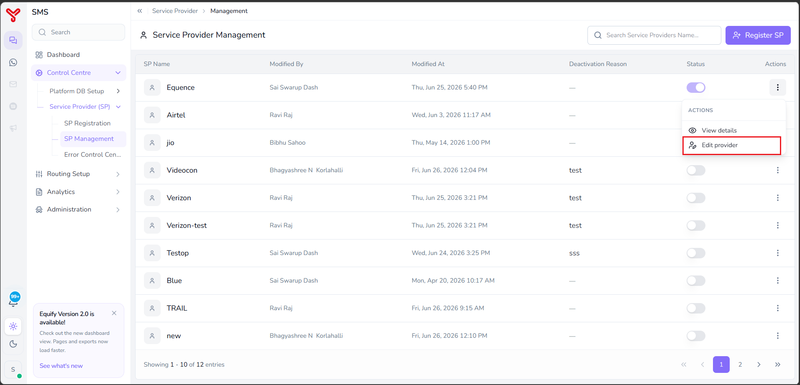

# Update service provider

---

User can update the registered service provider using **SP Management** feature. This guide describes the procedure for updating the service provider registration.

---

## To update a service provider

1. Navigate to **Control Centre > Service Provider (SP) > SP Management**.
2. Click the **Actions** menu (⋮) of the SP registration that you want to update.
3. Select **Edit provider** from the **ACTIONS** menu.  

    

4. Update the steps **Configure Request API**, **Success, Error and DLR response**, and **Review & submit** as required. For more information about the available fields, refer to *[SP registration](service-provider-registration.md)*.
5. Click **Submit**.

The updated SP registration is saved and is now available for use by the Equify.

!!! note
    User can create a new SP registration by clicking **Register SP** in the top-right corner of the screen. For more information, refer to *[SP registration](service-provider-registration.md)*

---

## Related articles

- [View service provider details](view-sp-details.md)
- [Service provider registration](service-provider-registration.md)