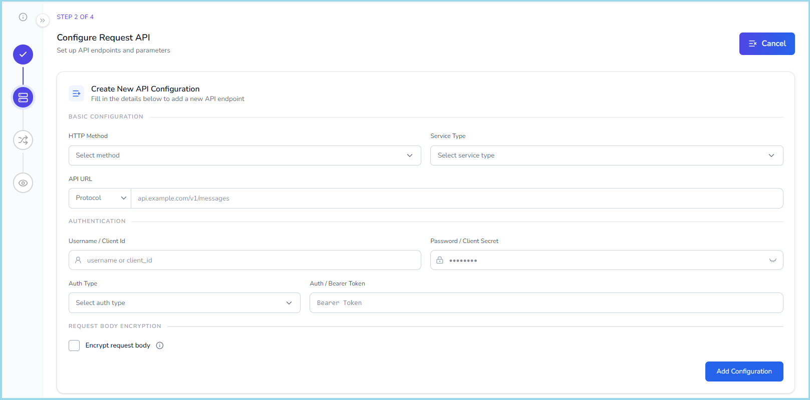
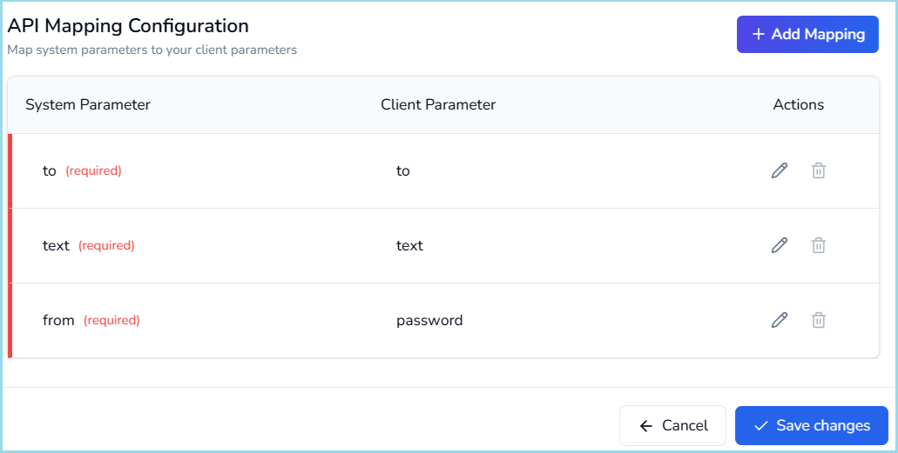
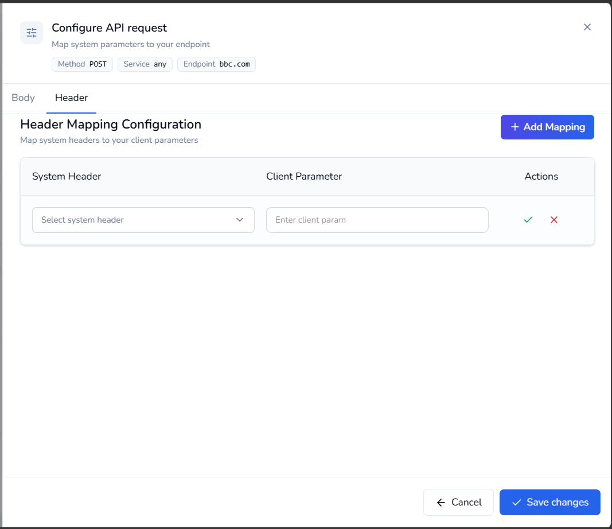

# Service provider registration

---

A Service Provider (SP) represents an SMS gateway or messaging platform that Equify uses to send messages. Before message can be routed to a provider, the provider must be registered and its request and response settings must be configured.

---

## Before you begin

Ensure that you have the following information from your SMS provider:

- Service provider name
- API endpoint URL
- HTTP method (GET or POST)
- Authentication credentials
- Request parameters and headers
- Success response format
- Error response format
- DLR (Delivery Receipt) response format

---

## Register a Service provider

1. Navigate to **Control Centre › Service Provider (SP) › SP Registration**.
2. The **Register Service Provider** wizard opens, showing four steps:
    1. **Service Provider Details**: enter basic service provider information
    2. **Configure Request API**: set up API endpoints and parameters
    3. **Response Mapping**: set up success, error, and DLR response handling
    4. **Preview**: review your information

    !!! Note
        Completed steps remain accessible. You can return to a previous step to modify the configuration without losing your progress.

=== "Step 1"

    ## Service Provider Details

    In this step, provide the basic details of the service provider.

    | Field | Description |
    | --------------------- | --------------- |
    | **Service Provider Name** | Enter a unique name to identify the service provider.                          |
    | **Channel** | Displays the current workspace channel. This value is automatically populated. |
    | **Code** | Displays the unique provider code. This value is automatically generated.      |

     

    ### Procedure

      1. Enter the **Service Provider Name**.
      2. Verify the automatically populated **Channel** and **Code values**.
      3. Click **Save and continue**.

      The service provider details are saved successfully.

=== "Step 2"

    ## Configure Request API

    In this step, configure the API endpoint that Equify uses to submit messages to the service provider.

    !!! Note
        Set up at least one API endpoint with its parameters, headers, and authentication to continue.

     

    **Create an API Configuration**

      1. Click **Create** or **Add your first API configuration**.
      2. The **Create New API Configuration** screen opens.
     

      3. Select the HTTP method from the **HTTP Method** dropdown.

        === "POST"

            Select **POST** when the provider expects message data in the request body.

            POST requests support:

            - JSON request body
            - Parameter mapping
            - Request body encryption

        === "GET"

            Select **GET** when the provider expects parameters in the URL query string.

            GET requests:

            - Do not require a JSON request body
            - Pass parameters through URL query parameters

      4. Select a service type from the **Service Type** dropdown.

        === "Any"

            Select **Any** if the API can process all message categories.

        === "OTP"

            Select **OTP** if the API is dedicated to one-time password messages.

        === "Transactional"

            Select **Transactional** for notifications, alerts, and business-critical messages.

        === "Promotional"

            Select **Promotional** for marketing and advertising campaigns.

      5. Select either **http://** or **https://** from the **Protocol** dropdown.
      6. Enter the API URL in the **URL** field.
      7. Select the authentication method from the **Auth Type** dropdown.
      
        === "Basic Auth"

            Use Basic Authentication when the provider requires a username and password.

            | Field | Description |
            |---------|-------------|
            | Username / Client ID | Provider username or client identifier |
            | Password / Client Secret | Provider password or secret |

        === "Bearer Auth"

            Use Bearer Authentication when the provider requires a bearer token.

            | Field | Description |
            |---------|-------------|
            | Bearer Token | Authentication token supplied by the provider |

      8. Select **Encrypt request body** if the service provider requires encrypted request payloads.
      9. Click **Add Configuration**.

        !!! Note
            Add multiple API configuration as required.

        After creating API configuration, the **Configure API Request** section appear.

      10. Perform the following steps to configure API request:

          Request mapping defines how Equify message parameters are translated into the provider-specific API request format.

          1. Configure **Body** tab:

              1. Paste the JSON request body provided by the service provider into the request body field.

                { width="600" }

              2. Verify that the JSON preview is generated successfully.
              3. Click **Add Mapping**.
              4. Select a **System Parameter**.
              5. Select the corresponding **Client Parameter**.
              6. Click the green tick to save the row or click the red cross to delete it.
              7. Repeat the process until all required parameters are mapped.

                Common mandatory parameters:

                - from
                - to
                - text

                { width="600" }

                !!! warning
                    All mandatory parameters must be mapped before the configuration can be saved.

          2. Configure **Header** tab:
              1. Select the **Header** tab.
              2. Click **Add Mapping**.
              3. Select a **System Header**.
              4. Select the corresponding **Client Header**.
              5. Click the green tick to save the row or click the red cross to delete it.
              6. Repeat the process until all required parameters are mapped.
              
                  { width="500" }

          3. Click **Save changes**.

              The request API configuration is saved successfully.
            
        !!! Note
            You can create additional API configurations by clicking **Create** in the upper-right corner of the screen.

      13. Click **Save and continue**.

      The request API configuration is saved successfully.


=== "Step 3"

    ## Success, Error and DLR response

    In this step, configure how Equify interprets responses received from the service provider.

     

    ### Success

    1. Select the **Success** tab.
    2. Paste the provider success response JSON.
    
        ```json
        {
          "status": "success",
          "message_id": "123456"
        }
        ```

    3. Click **Submit**.
    4. In the Success Response section, configure the following fields:

        | Field | Description |
        |---------|-------------|
        | **Success Message** | JSON field containing the success status |
        | **Response ID** | JSON field containing the provider message ID |

    ### Error

    Select the **Error** tab.

     

    1. Paste the provider error response JSON.

        ```json
        {
          "status": "failed",
          "message": "Error Occured",
          "status_code": 403
        }
        ```

    2. Click **Submit**.
    3. In the Error Response section, configure the following fields::

        | Field | Description |
        |---------|-------------|
        | Error Code | JSON field containing the provider error code |
        | Error Message | JSON field containing the error description |

    ### DLR Response

    Select the **DLR** tab.

     

    1. Paste the DLR response JSON provided by the service provider.
    2. Click **Save and continue**.

    The success, error, and DLR response configurations are saved successfully.

=== "Step 4"

    ## Review and Complete

    Review all configured information before completing the registration.

    Verify the following:

    - Service provider details
    - Request API configuration
    - Authentication settings
    - Request mapping
    - Success response mapping
    - Error response mapping
    - DLR response mapping

    ### Complete Registration

    1. Review all information carefully.
    2. Click **Submit**.

---

The service provider is registered successfully and becomes available in:

  - **SP Management**
  - **Routing Setup**
  - **Message Routing Configurations**

!!! tip
    Send a test message after registration to verify connectivity, authentication, request mappings, and response processing.
---

## What to do next

- Manage providers in [Service provider management](service-provider-management.md)
- Configure routing in [Routing setup](../routing-setup/index.md)


<div class="home-support-banner">
  <div class="support-left">
    <h2 class="support-title">Need some help?</h2>
    <p class="support-desc">
      Communication at scale isn’t always simple. Get instant help from our
      <a href="https://equence.com/contact.html">support team</a>, or browse the
      <a href="../../../faq/#faq">FAQ</a> for quick answers.
    </p>
    <div class="support-legal">
      <a href="https://equence.com/terms.html">Terms of service</a>
      <a href="https://equence.com/privacy-policy.html">Privacy Policy</a>
      <span>© 2026 Equify. All rights reserved.</span>
    </div>
  </div>
  <div class="support-right">
    <div class="support-icon-cluster">
      <div class="support-icon-bubble support-icon-bubble--1">🎧</div>
      <div class="support-icon-bubble support-icon-bubble--2">💬</div>
      <div class="support-icon-bubble support-icon-bubble--3">🛡️</div>
    </div>
  </div>
</div>