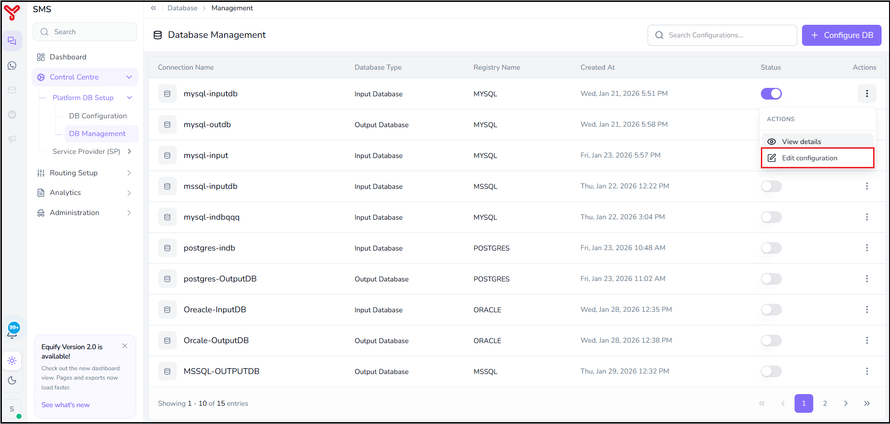

# Update DB configuration

---

User can update the existing database configuration using **DB Management** feature. This guide describes the procedure for updating a database configuration.

---

## To update a database configuration

1. Navigate to **Control Centre > Platform DB Setup > DB Management**.
2. Click the **Actions** menu (⋮) of the database configuration that you want to update.
3. Select **Edit configuration** from the **ACTIONS** menu.  

    

4. Update the fields as required. For more information about the available fields, refer to *[DB configuration](database-setup.md)*
5. Click **Update Configuration**.

The updated database configuration is saved and is now available for use by the Equify.

!!! note
    User can create a new database configuration by clicking **Configure DB** in the top-right corner of the screen. For more information, refer to *[DB configuration](database-setup.md)*

---

## Related articles

- [View DB configuration](view-db-configuration.md)
- [DB configuration](database-setup.md)