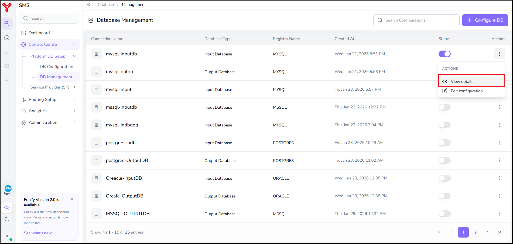

# Update DB configuration

---

User can view the created database configuration details using **DB Management** feature. This guide describes the procedure for viewing database configuration details.

---

## To view database details

1. Navigate to **Control Centre > Platform DB Setup > DB Management**.

    The **DB Management** screen lists configured databases with the following information:

    | Column | Description |
|---|---|
| **Connection Name** | The unique identifier/label given to the database connection. |
| **Database Type** | Indicates whether the connection is used as an input database or output database. |
| **Registry Name** | The underlying database engine/technology used. |
| **Created At** | Date and timestamp when the connection was configured. |
| **Status** | Toggle switch showing whether the connection is currently active (ON) or inactive (OFF). |
| **Actions** | A menu (⋮) offering options to edit or view the specific DB connection. |

2. Click the **Actions** menu (⋮) of the database configuration that you want to update.
3. Select **View details** from the **ACTIONS** menu.  

    

The database configuration details screens opens and displays the complete configuration information for the selected database connection.

!!! note
    * User can create a new database configuration by clicking **Configure DB** in the top-right corner of the screen. For more information, refer to *[DB configuration](database-setup.md)*
    * User can update an existing database configuration by clicking **Edit** in the top-right corner of the screen. For more information, refer to *[Update DB configuration](update-db-configuration.md)*

---

## Related articles

- [Update DB configuration](update-db-configuration.md)
- [DB configuration](database-setup.md)