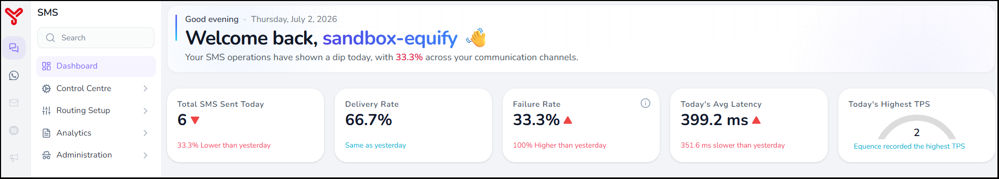
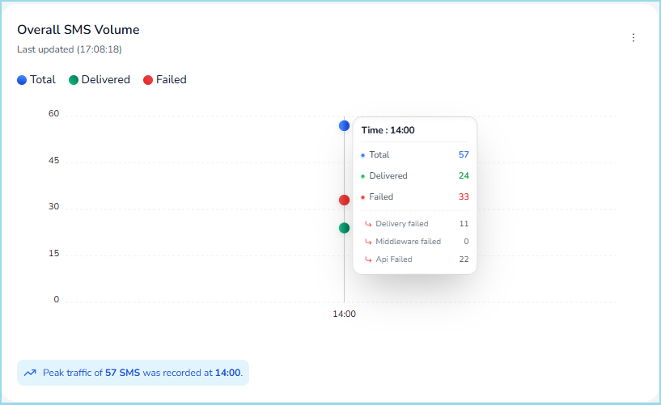

# Dashboard Overview {#dashboard}

---

The Dashboard is the landing page of the Equify SMS platform. It provides a centralized view of messaging activity, provider performance, system health, and application status. It helps users monitor real-time operations and identify issues quickly.

Dashboard allows users to quickly identify trends, monitor ongoing operations, and investigate issues without navigating through multiple areas of the application.

---

## Dashboard Components

The dashboard is organized into several sections that provide visibility into different aspects of SMS operations.

### Summary Metrics

The summary cards displayed at the top of the page provide an immediate view of key operational metrics for the current day.

  

The metrics include:

* **Total SMS Sent Today** – Displays the total number of SMS messages sent on the current day.
* **Delivery Rate** – Percentage of successfully delivered messages.
* **Failure Rate** – Percentage of messages that failed to deliver.
* **Today's Avg Latency** – Displays the average time taken for message delivery.
* **Today's Highest TPS** – Displays the highest Transactions Per Second (TPS) recorded during the day.

These metrics allow users to quickly determine whether SMS operations are performing as expected.

---

### Monitoring Views

The dashboard provides multiple monitoring views that focus on different aspects of platform operations.

- **SMS Volume**: Displays SMS traffic and delivery statistics across the platform.
- **Service Providers**: Displays provider utilization and delivery performance information. 
- **System Health**: Displays the operational status of platform infrastructure and services.
- **Applications**: Displays activity and health information for integrated applications.

Users can switch between views to analyze different operational areas.

=== "SMS Volume"

    **SMS Volume** view has the following sections:

    ### Overall SMS Volume

    The **Overall SMS Volume** section displays SMS traffic processed by the platform during the selected reporting period.
    
    Shows total, delivered, and failed messages.

  

    This view helps users:

    - Monitor overall messaging activity
    - Identify traffic spikes or unusual volume changes
    - Analyze communication trends over time
    - Highlights peak traffic time.

    ### SMS Volume by Department

    The **SMS Volume by Department** section displays how SMS traffic is distributed across departments configured within the platform.

    This information helps organizations understand communication usage patterns and identify departments generating significant messaging traffic.

    ## SMS Volume by Service Provider

    The **SMS Volume by Service Provider** section displays message distribution across configured service providers.

    This information can be used to:

    * Review provider utilization
    * Verify routing behavior
    * Monitor traffic distribution
    * Evaluate provider performance

    ## SMS Volume by Service Type

    The **SMS Volume by Service Type** section categorizes SMS traffic based on message type.

    Depending on the organization's configuration, service types may include:

    * OTP messages
    * Transactional messages
    * Notification messages
    * Promotional messages

    This view helps users understand how messaging traffic is distributed across different business communication categories.

    ## Last Updated Information

    Each dashboard widget displays a **Last Updated** timestamp indicating when the displayed data was most recently refreshed.

    This information helps users determine the freshness of dashboard data when monitoring platform activity.

    ## Refresh Dashboard Data

    The **Refresh** option retrieves the latest available dashboard information.

    Users can use this option when monitoring active communication events or investigating operational issues that require current data.

=== "Service Provider"

    To be added dsds

=== "System Health"

    To be added

=== "Applications"

    To be added

