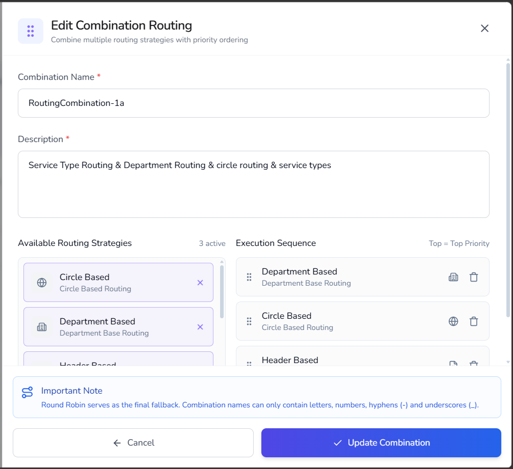

# Edit routing combinations

---

Use this procedure to modify an existing routing combination, including its name, description, routing strategies, or execution sequence.

---

### Procedure

1. Navigate to **Routing Setup** > **Traffic Management**.
2. Select the **Combinations** tab.

    

3. Locate the routing combination that you want to modify.
4. In the **Actions** column, select the **Configure** icon.

   The **Edit Combination Routing** dialog box opens.

5. Update the **Combination Name**, if required.

    { width="600" }

6. Update the **Description**, if required.

7. To add a routing strategy:

    1. Locate the required strategy under **Available Routing Strategies**.
    2. Select the **Add (+)** icon.

       The strategy is added to the **Execution Sequence** section.

8. To remove a routing strategy:

    1. Locate the strategy in the **Execution Sequence** section.
    2. Select the **Delete** icon.

       The strategy is removed from the execution sequence.

9. To change the routing priority:

    1. Drag and drop the routing strategies into the required order.
    2. Place the highest-priority strategy at the top of the list.

10. Review the updated execution sequence.

11. Select **Update Combination**.

The routing combination is updated successfully.

The updated routing combination is available in the Combination Routing list. The system evaluates routing strategies according to the revised execution sequence.

!!! Notes
    - Changes to the execution sequence affect the order in which routing rules are evaluated.
    - The routing strategy at the top of the execution sequence has the highest priority.
    - Round Robin routing remains the final fallback mechanism for unmatched traffic.

---

## Related articles

- [Create routing combinations](routing-combinations.md)
- [Routing overview](index.md)

  

    <h2 class="support-title">Need some help?</h2>
    

      Communication at scale isn’t always simple. Get instant help from our
      <a href="/support/">support team</a>, or browse the
      <a href="/faq/#faq">FAQ</a> for quick answers.
    

    

      <a href="/terms/">Terms of service</a>
      <a href="/privacy/">Privacy Policy</a>
      © 2026 Equify. All rights reserved.
    

  

  

    

      
🎧

      
💬

      
🛡️

    

  

