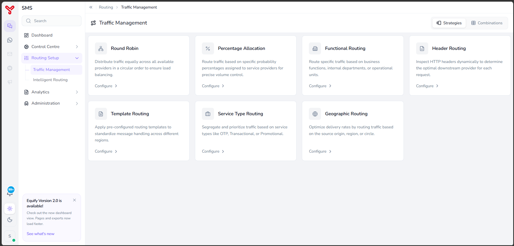
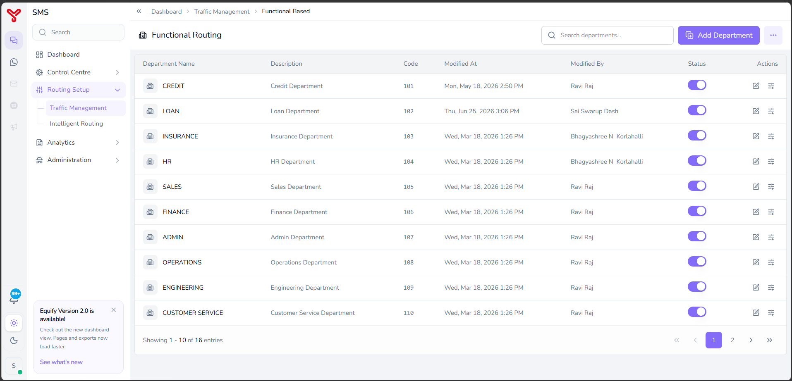
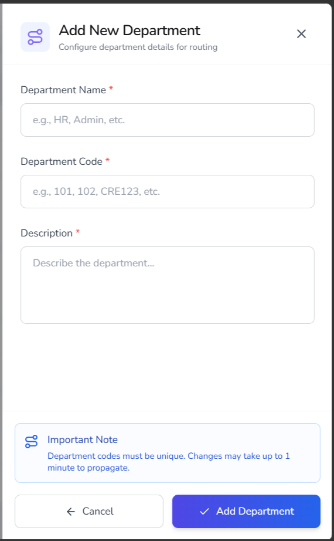
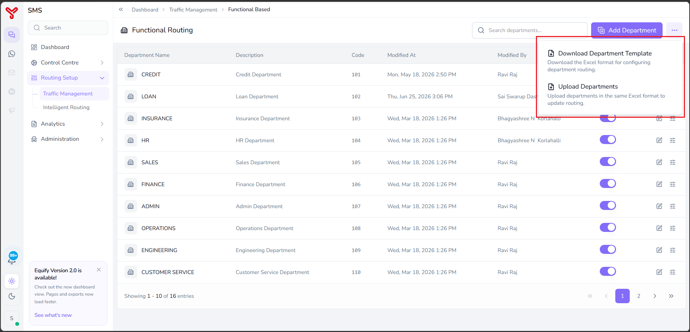
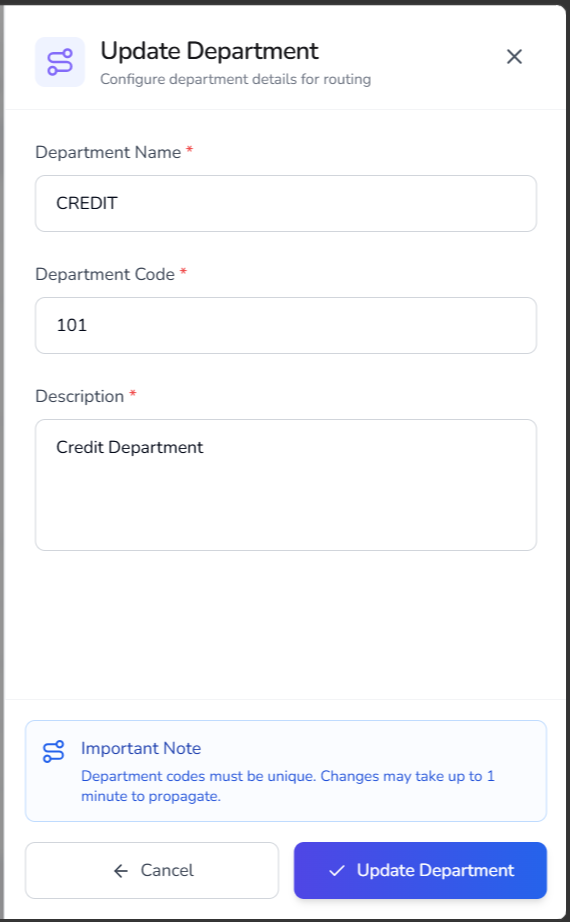
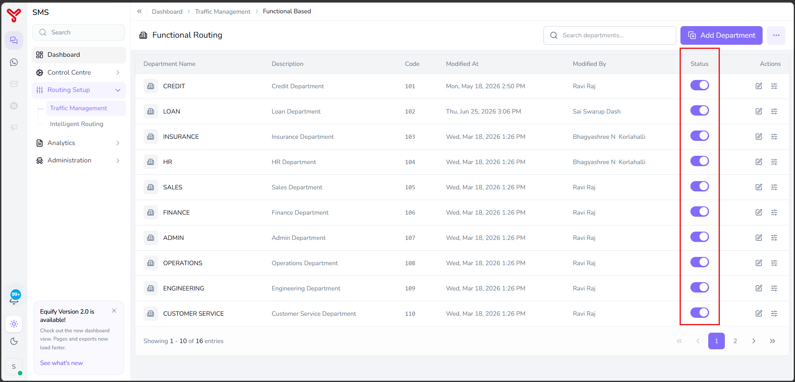
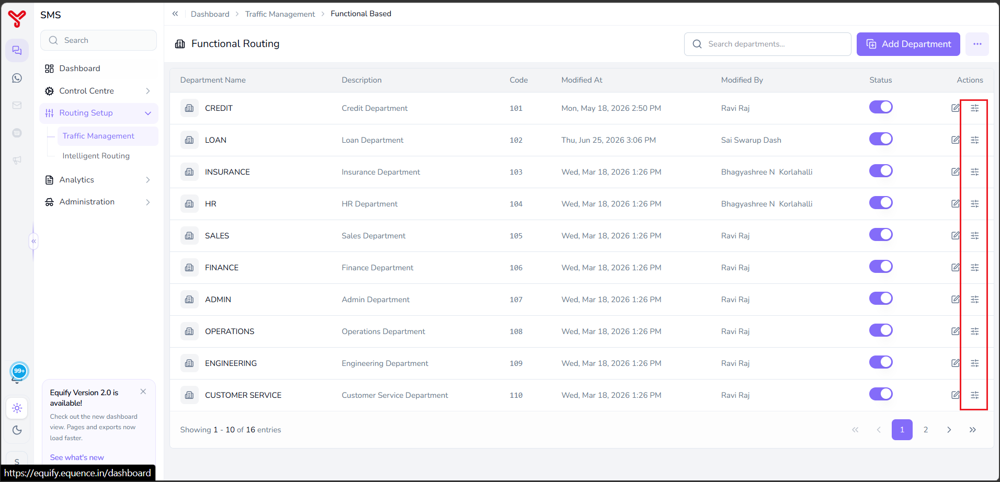
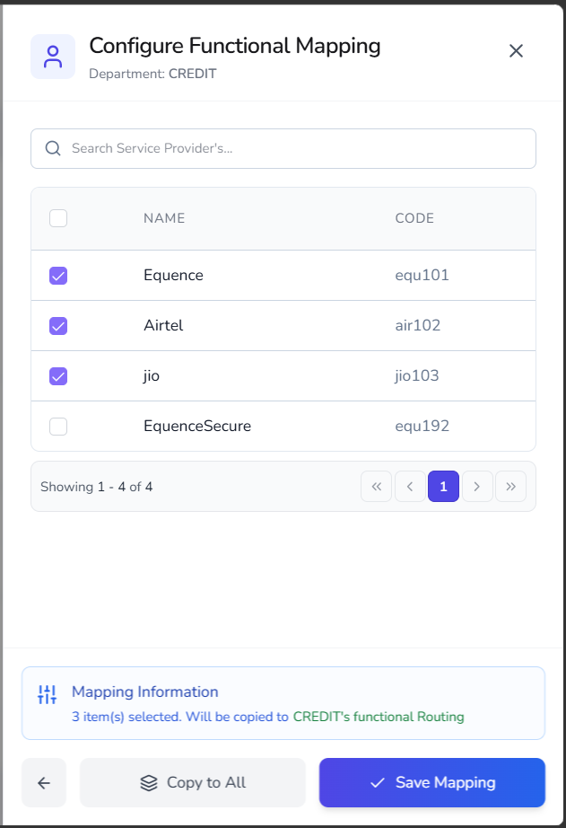

# Functional Routing

---

**Functional Routing** allows you to route messages based on business functions or departments within your organization. Each department can be mapped to one or more service providers, enabling different teams to use different SMS gateways based on operational requirements.

To configure functional routing, create departments, assign providers to each department, and then use those mappings as part of your overall routing strategy and routing combinations.

For example:

- Credit-related messages can be routed through one set of providers.
- Sales notifications can be routed through another set of providers.
- Customer service alerts can use a dedicated provider group.

---

## Before you begin

Ensure that:

- Service providers are registered and active.
- Department information is available.
- Routing requirements for each department are defined.

---

## Open functional routing

1. Navigate to **Routing Setup** > **Traffic Management**.
2. Select **Functional Routing**.

   

The functional routing page displays the available departments and their routing configurations.

| Column | Description |
|----------|-------------|
| **Department Name** | Name of the business department. |
| **Description** | Department description. |
| **Code** | Unique department code. |
| **Modified At** | Date and time of the last modification. |
| **Modified By** | User who last modified the department. |
| **Status** | Enables or disables the department routing configuration. |
| **Actions** | Edit department details or configure provider mappings. |

   

### Available actions

| Action | Description |
|----------|-------------|
| **Search** | Search for departments. |
| **Add Department** | Create a new department. |
| **More Options** | Download or upload department configurations. |
| **Status Toggle** | Enable or disable a department. |
| **Edit** | Modify department information. |
| **Configure Mapping** | Assign service providers to a department. |

---

## Create a department

Create departments before assigning service providers.

### Procedure

1. Open **Functional Routing**.
2. Click **Add Department**.
3. Enter the department details.

    | Field | Description |
    |---------|-------------|
    | **Department Name** | Unique department name. |
    | **Department Code** | Unique department code. |
    | **Description** | Department description. |

      { width="300" }

4. Click **Add Department**.

The department is created and appears in the department list. Configure provider mappings for the newly created department.

!!! note

    Department codes must be unique. Changes may take up to one minute to propagate throughout the platform.

---

## Download the department template

Use the template to prepare bulk department configurations.

### Procedure

1. Open **Functional Routing**.
2. Click the **More Options** menu.

      

3. Select **Download Department Template**.

An Excel template is downloaded. Populate the template and upload it using the department import feature.

---

## Upload departments

Import multiple departments from an Excel file.

### Procedure

1. Open **Functional Routing**.
2. Click the **More Options** menu.
3. Select **Upload Departments**.

      

4. Select the completed department template.
5. Upload the file.

Departments are created or updated based on the uploaded data.

---

## Edit a department

Modify department information when business requirements change.

### Procedure

1. Open **Functional Routing**.
2. Locate the department.
3. Click the **Edit** icon.

    The **Update Department** window opens.

      { width="300" }

4. Update the required fields.
5. Click **Update Department**.

The department information is updated. Review existing provider mappings to ensure they still align with business requirements.

!!! note

    Department codes must be unique. Changes may take up to one minute to propagate throughout the platform.

---

## Enable or disable a department

You can temporarily disable routing for a department without deleting its configuration.

### Procedure

1. Open **Functional Routing**.
2. Locate the required department.
3. Use the **Status** toggle.

    **Status values**

    | Status | Description |
    |----------|-------------|
    | **Enabled** | Functional routing is active for the department. |
    | **Disabled** | Functional routing is ignored for the department. |

      

The department routing status is updated immediately.

---

## Configure provider mappings

Provider mappings determine which service providers can be used by a department.

### Procedure

1. Open **Functional Routing**.
2. Locate the department.
3. Click the **Configure Mapping** icon.

      

    The **Configure Functional Mapping** window opens.

4. Search for providers if required.

      { width="300" }

5. Select one or more service providers.
7. Review the **Mapping Information** section.

    The section displays:

    - Number of selected providers.
    - Target department receiving the mapping.

8. Choose one of the following actions:

    | Action | Description |
    |----------|-------------|
    | **Save Mapping** | Save mappings only for the current department. |
    | **Copy to All** | Apply the selected provider mapping to all departments. |

9. Click **Save Mapping**.

The selected service providers are assigned to the department.

---

## What to do next

- Explore other routing strategies in [Routing overview](index.md)
- Combine strategies in [Create routing combinations](routing-combinations.md)