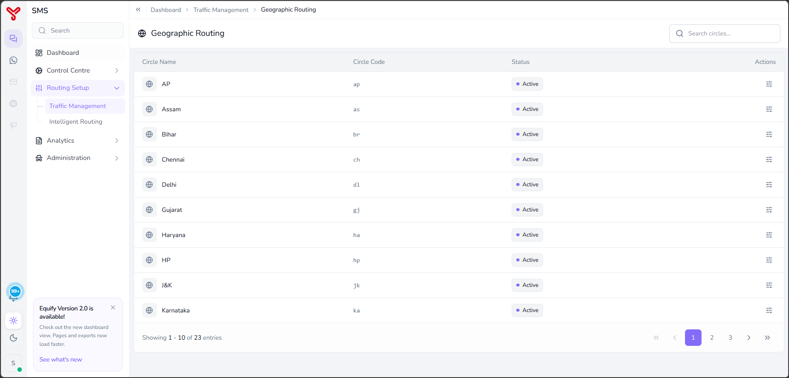
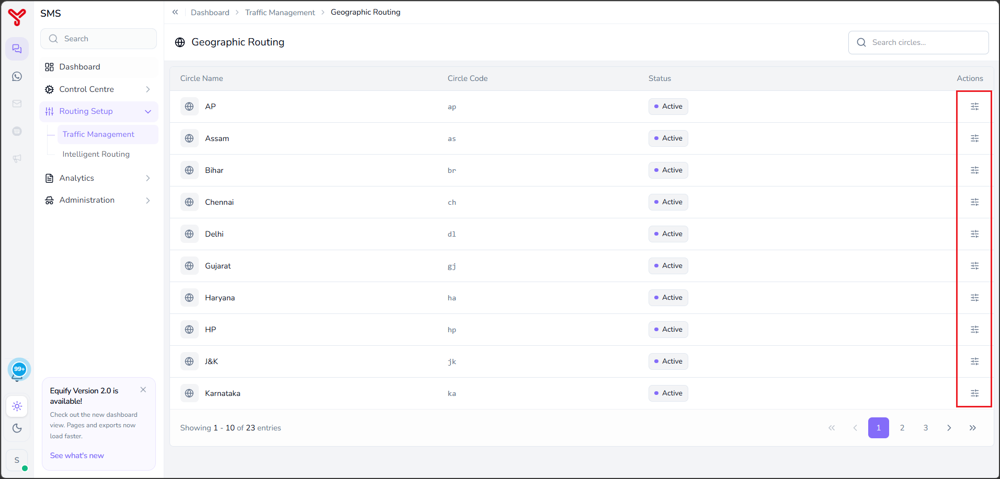
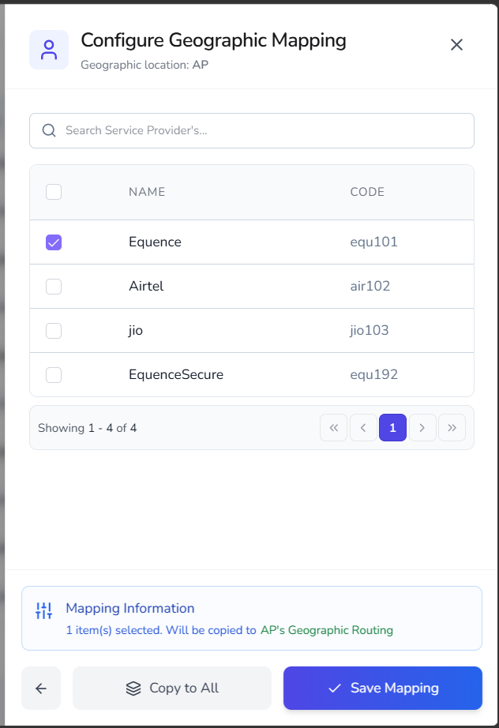

# Geographic routing

---

**Geographic Routing** allows you to associate service providers with specific telecom circles or geographic regions. These mappings determine which service providers are available to process messages originating from a particular geographic location.

To configure geographic routing:

1. Select a geographic circle.
2. Map one or more service providers to the circle.
3. Save the mapping configuration.

---

## Open geographic routing

The **Geographic Routing** page opens with the following information:

| Column | Description |
|----------|-------------|
| **Circle Name** | Name of the telecom circle or geographic region. |
| **Circle Code** | Unique code assigned to the circle. |
| **Status** | Indicates whether the circle is active. |
| **Actions** | Provides access to geographic mapping configuration. |

### Available actions

| Action | Description |
|----------|-------------|
| **Configure Mapping** | Maps service providers to the selected geographic circle. |

---

## Configure geographic mapping

Geographic mapping determines which service providers can be used for message delivery within a specific telecom circle.

### Procedure

1. Navigate to **Routing Setup > Traffic Management > Geographic Routing**.
2. Locate the required circle.
3. Click the **Configure Mapping** icon.

     

    The **Configure Geographic Mapping** window displays all available service providers that can be associated with the selected geographic location.

4. Select one or more service providers.

    { width="300" }

5. (Optional) Click **Copy to All** to apply the same provider mapping to all geographic circles.
5. Click **Save Mapping**.

The selected service providers are mapped to the geographic circle.

---

## What to do next

- Explore other routing strategies in [Routing overview](index.md)
- Combine strategies in [Create routing combinations](routing-combinations.md)

  

    <h2 class="support-title">Need some help?</h2>
    

      Communication at scale isn’t always simple. Get instant help from our
      <a href="https://equence.com/contact.html">support team</a>, or browse the
      <a href="../../../faq/#faq">FAQ</a> for quick answers.
    

    

      <a href="https://equence.com/terms.html">Terms of service</a>
      <a href="https://equence.com/privacy-policy.html">Privacy Policy</a>
      © 2026 Equify. All rights reserved.
    

  

  

    

      
🎧

      
💬

      
🛡️

    

  

