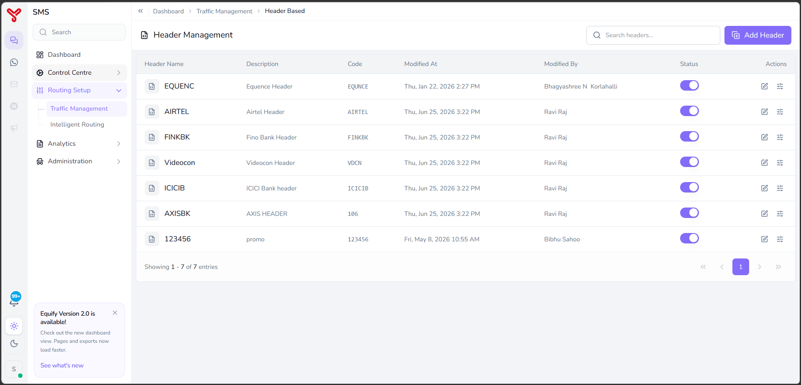
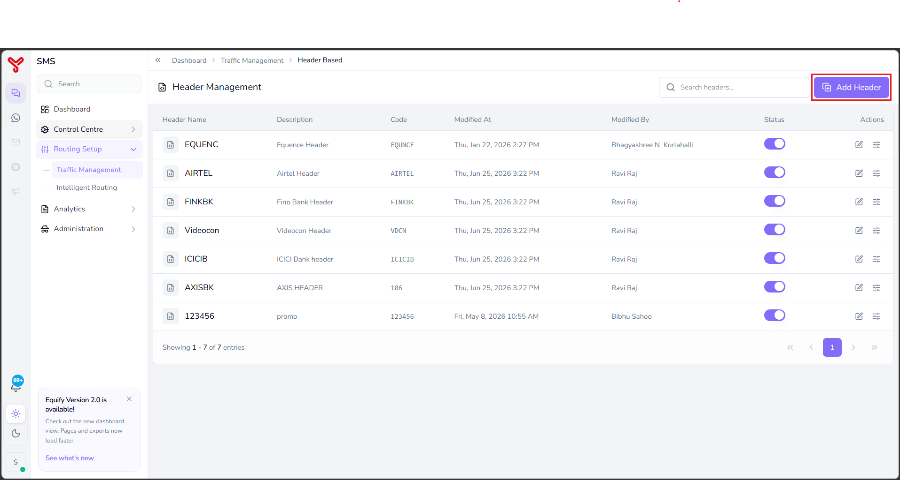
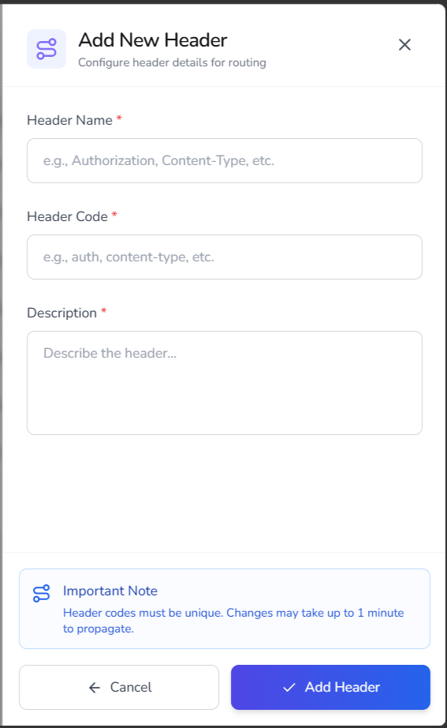
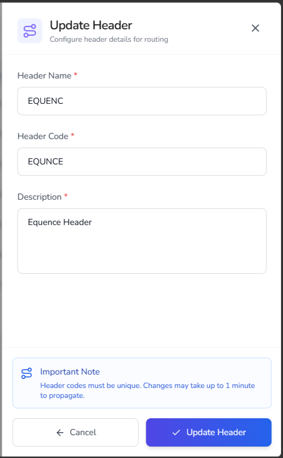
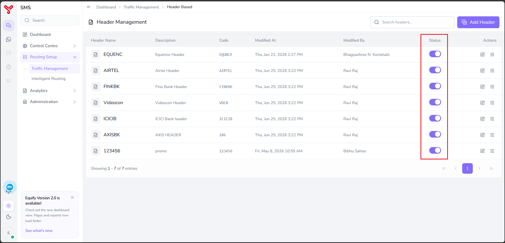
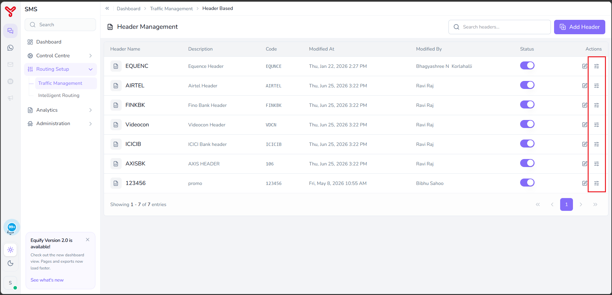
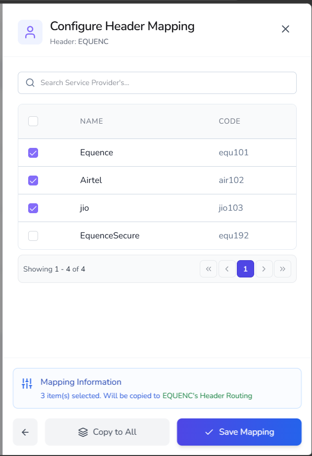

# Header routing

---

**Header Routing** enables routing decisions based on values supplied in request headers. It allows the calling application to influence routing behavior by including predefined header values in API requests.

For example:

- Banking applications can use one header value to route traffic through a preferred provider group.
- Promotional campaigns can use a different header value.
- Partner integrations can specify routing preferences without modifying existing routing strategies.

Header Routing is configured in two stages:

1. Create and manage headers that represent routing identifiers.
2. Map one or more service providers to each header.

When a request contains a configured header value, Equify evaluates the header and routes traffic using the providers mapped to that header.

---

## Open header management

1. Navigate to **Routing Setup**.
2. Select **Traffic Management**.
3. Click **Header Routing**.

   

The **Header Management** page opens with the following information:

| Column | Description |
|----------|-------------|
| **Header Name** | The display name of the routing header. This is used to identify the header configuration within Equify. |
| **Description** | A brief explanation of the header's purpose or business use case. |
| **Code** | The unique header code used by applications when submitting requests. Equify uses this value to identify the correct Header Routing configuration. |
| **Modified At** | The date and time when the header configuration was last updated. |
| **Modified By** | The user who most recently modified the header configuration. |
| **Status** | Indicates whether the header configuration is active. Active headers can participate in routing decisions. |
| **Actions** | Provides options to edit the header configuration or configure provider mappings. |

   

**Available actions**

| Action | Description |
|------------|-------------|
| **Search Headers** | Searches configured headers by name. |
| **Add Header** | Creates a new routing header. |
| **Header List** | Displays configured headers. |
| **Status Toggle** | Enables or disables a header configuration. |
| **Edit Header** | Updates header details. |
| **Configure Mapping** | Assigns service providers to a header. |

---

## Create header

Use this procedure to create a new routing header.

### Procedure

1. Open **Header Management**.
2. Click **Add Header**.

       

    The **Add New Header** window opens.

3. In **Header Name**, enter the header name.

       { width="300" }

4. In **Header Code**, enter a unique header code.
5. In **Description**, enter a description.
6. Click **Add Header**.

!!! note

    Header codes must be unique. Changes may take up to one minute to propagate throughout the platform.

The header is created and appears in the **Header Management** list. Configure provider mappings for the newly created header.

---

## Edit header

Use this procedure to modify an existing header.

### Procedure

1. Open **Header Management**.
2. Locate the header.
3. Click the **Edit** icon.
4. Update the fields as required

    { width="300" }

5. Click **Update Header** to save changes.

The header configuration is updated. Review the provider mappings associated with the header.

---

## Enable or disable header

Use this procedure to control whether a header participates in routing decisions.

### Procedure

1. Open **Header Management**.
2. Locate the header.
3. Use the **Status** toggle.

    - Enable the toggle to activate the header.
    - Disable the toggle to deactivate the header.

    

The header is enabled or disabled for routing. Verify routing configurations before processing traffic.

---

## Configure header mapping

Use this procedure to associate service providers with a header.

### Procedure

1. Open **Header Management**.
2. Locate the required header.
3. Click the **Configure Mapping** icon.

      

    The **Configure Header Mapping** window opens.

4. Review the available service providers.

5. Select the service providers that should be associated with the header.

      { width="300" }

7. (Optional) Click **Copy to All** to apply the same provider selection to all configured headers.

8. Click **Save Mapping**.

The selected providers are mapped to the header. Use the configured header value in API requests so that Equify can apply the corresponding routing logic.

---

## What to do next

- Explore other routing strategies in [Routing overview](index.md)
- Combine strategies in [Create routing combinations](routing-combinations.md)

  

    <h2 class="support-title">Need some help?</h2>
    

      Communication at scale isn’t always simple. Get instant help from our
      <a href="https://equence.com/contact.html">support team</a>, or browse the
      <a href="../../../faq/#faq">FAQ</a> for quick answers.
    

    

      <a href="https://equence.com/terms.html">Terms of service</a>
      <a href="https://equence.com/privacy-policy.html">Privacy Policy</a>
      © 2026 Equify. All rights reserved.
    

  

  

    

      
🎧

      
💬

      
🛡️

    

  

