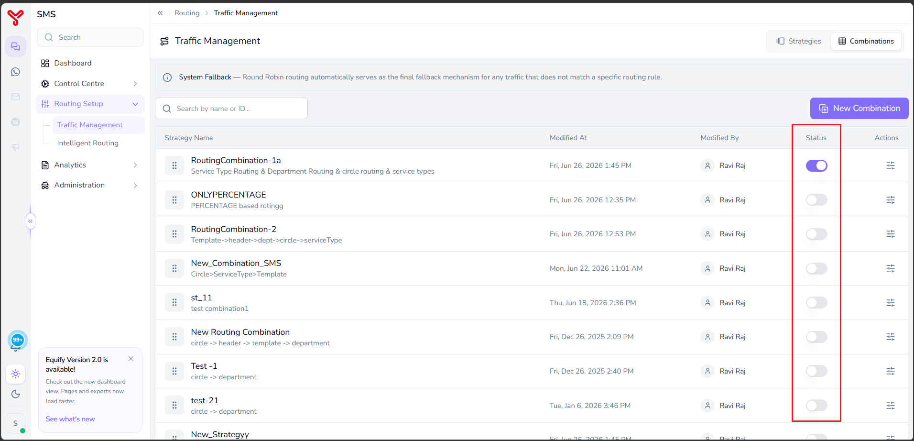

# Routing setup overview {#routing}

---

**Routing Setup** determines how Equify selects a service provider for each message. After service providers are registered and configured, use **Routing Setup** to define the rules that control message distribution across providers based on business requirements, traffic patterns, message types, regions, and routing priorities.

Routing Setup enables you to:

- Distribute traffic across multiple service providers
- Prioritize providers for specific message categories
- Route messages based on business functions or regions
- Balance traffic between providers
- Standardize routing behavior across campaigns
- Create complex routing decision flows using multiple strategies

---

## Open routing setup

1. In the left navigation pane, select **Routing Setup**.
2. Expand the menu to view the available routing sections.

The following options are available:

- Traffic Management
- Intelligent Routing (coming soon)

---

## Traffic management

Traffic Management is the central area where routing strategies are configured and managed.

When you open Traffic Management, the page displays two tabs:
    
- Strategies
- Combinations

=== "Strategies"

    The **Strategies** tab displays all available routing methods supported by Equify.

    Each strategy can be configured independently and later combined with other strategies to create more advanced routing workflows.
    
    The following routing strategies are available:

    | Strategy | Description |
    |-----------|-------------|
    | **Round Robin** | Distributes traffic equally across available service providers in a circular sequence. |
    | **Percentage Allocation** | Routes traffic according to predefined percentage allocations assigned to each provider. |
    | **Functional Routing** | Routes traffic based on business functions, departments, or operational units. |
    | **Header Routing** | Uses HTTP header values to dynamically determine the destination provider. |
    | **Template Routing** | Routes messages based on predefined message templates. |
    | **Service Type Routing** | Routes messages according to categories such as OTP, Transactional, or Promotional. |
    | **Geographic Routing** | Routes messages based on geographic region, telecom circle, or source location. |

=== "Routing combinations"

    Routing Combinations allow you to combine multiple routing strategies into a single routing workflow.

    A routing combination defines the order in which Equify evaluates routing rules when selecting a service provider for outbound traffic.

    Routing combinations help organizations implement complex routing requirements while maintaining a predictable fallback path.

    ### Open routing combinations

    1. Navigate to **Routing Setup > Traffic Management**.
    2. Select the **Combinations** tab.

    The Routing Combinations page opens and displays the following information:

    | Column | Description |
    |----------|-------------|
    | Strategy Name | Name of the routing combination. |
    | Description | Summary of the routing sequence configured in the combination. |
    | Modified At | Date and time when the combination was last updated. |
    | Modified By | User who last modified the combination. |
    | Status | Indicates whether the routing combination is active or inactive. |
    | Actions | Opens management options for the selected combination. |

    ---

    ### Enable or disable a routing combination

    Use the **Status** toggle to activate or deactivate a routing combination.

    ### Activate a combination

    1. Locate the routing combination.
    2. Turn on the **Status** toggle.

    

    The combination becomes available for routing decisions.

    ### Deactivate a combination

    1. Locate the routing combination.
    2. Turn off the **Status** toggle.

    The combination is excluded from routing decisions until reactivated.

    !!!Note
        By default, **Round Robin** routing automatically serves as the final fallback mechanism for any traffic that does not match a specific routing rule.

---

## What to do next

- Choose a routing strategy
- Configure routing logic using:
    - [Round Robin](round-robin.md)
    - [Percentage Allocation](percentage-allocation.md)
- Create routing combinations in [Routing combinations](routing-combinations.md)

  

    <h2 class="support-title">Need some help?</h2>
    

      Communication at scale isn’t always simple. Get instant help from our
      <a href="/support/">support team</a>, or browse the
      <a href="/faq/#faq">FAQ</a> for quick answers.
    

    

      <a href="/terms/">Terms of service</a>
      <a href="/privacy/">Privacy Policy</a>
      © 2026 Equify. All rights reserved.
    

  

  

    

      
🎧

      
💬

      
🛡️

    

  

