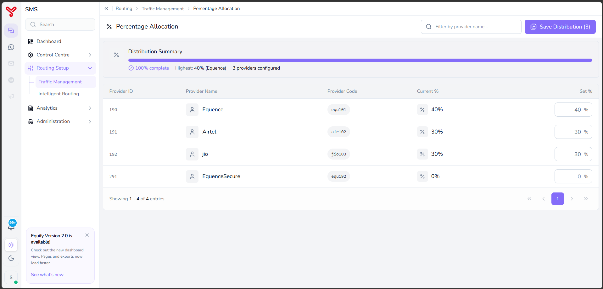

# Percentage allocation routing

---

Percentage Allocation Routing distributes traffic according to defined percentages. Each provider receives traffic based on its assigned allocation.

Use Percentage Allocation Routing when you want to:

- Gradually migrate traffic to a new provider.
- Split traffic between primary and secondary providers.
- Allocate traffic based on contractual commitments.

---

## Before you begin

Ensure that:

- Service providers are registered and active.
- The required providers are available for routing.
- Total allocation percentages equal 100%.

---

## Open percentage allocation routing

1. Navigate to **Routing Setup > Traffic Management**.

      

2. Select **Percentage Allocation**.
3. The **Percentage Allocation** screen opens.

---

## Configure percentage allocation

The screen displays all available service providers with the following informations:

| Column | Description |
|----------|-------------|
| **Provider ID** | Unique provider identifier. |
| **Provider Name** | Service provider name. |
| **Provider Code** | Unique provider code. |
| **Current %** | Currently assigned traffic percentage. |
| **Set %** | Percentage of traffic to assign to the provider. |

   

### Procedure

1. Locate the required provider.
2. Enter the desired traffic percentage in the **Set %** field.
3. Repeat for all required providers.
4. Verify that the total allocation equals **100%**.
5. Confirm that the **Distribution Summary** displays **100% complete**.
6. Click **Save Distribution**.

Percentage Allocation Routing is configured successfully.

Equify distributes traffic according to the configured percentages.

---

## What to do next

- Explore other routing strategies in [Routing overview](index.md)
- Combine strategies in [Create routing combinations](routing-combinations.md)

  

    <h2 class="support-title">Need some help?</h2>
    

      Communication at scale isn’t always simple. Get instant help from our
      <a href="/support/">support team</a>, or browse the
      <a href="/faq/#faq">FAQ</a> for quick answers.
    

    

      <a href="/terms/">Terms of service</a>
      <a href="/privacy/">Privacy Policy</a>
      © 2026 Equify. All rights reserved.
    

  

  

    

      
🎧

      
💬

      
🛡️

    

  

