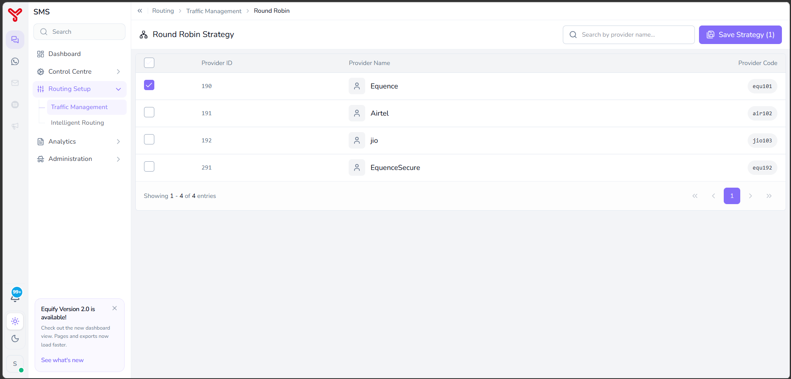

# Round robin routing

---

Round Robin Routing distributes messages evenly across multiple service providers. Each new message is assigned to the next available provider in sequence, ensuring balanced traffic distribution and reducing dependency on a single provider.

Use Round Robin Routing when you want to:

- Balance traffic across multiple providers.
- Prevent overloading a single provider.
- Maintain equal provider utilization.
- Configure a default fallback routing strategy.

---

## Before you begin

Ensure that:

- At least one service provider is registered.
- The required service providers are active.
- Service provider configurations have been verified.

---

## Open round robin routing

1. Navigate to **Routing Setup > Traffic Management**.

      

2. Select **Round Robin**.
3. The **Round Robin Strategy** screen opens.

---

## Configure round robin routing

The screen displays all available service providers with the following information:

| Column | Description |
|----------|-------------|
| **Provider ID** | Unique identifier assigned to the provider. |
| **Provider Name** | Registered service provider name. |
| **Provider Code** | Unique provider code. |
| **Selection Checkbox** | Includes the provider in the round robin sequence. |

   

### Procedure

1. Select the checkbox beside each provider you want to include in the routing sequence.
2. Optionally use the **Search by provider name** field to locate a specific provider.
3. Verify the selected providers.
4. Click **Save Strategy**.

Round Robin Routing is configured successfully.

Equify distributes messages sequentially across all selected providers.

---

## What to do next

- Explore other routing strategies in [Routing overview](index.md)
- Combine strategies in [Create routing combinations](routing-combinations.md)

  

    <h2 class="support-title">Need some help?</h2>
    

      Communication at scale isn’t always simple. Get instant help from our
      <a href="https://equence.com/contact.html">support team</a>, or browse the
      <a href="../../../faq/#faq">FAQ</a> for quick answers.
    

    

      <a href="https://equence.com/terms.html">Terms of service</a>
      <a href="https://equence.com/privacy-policy.html">Privacy Policy</a>
      © 2026 Equify. All rights reserved.
    

  

  

    

      
🎧

      
💬

      
🛡️

    

  

