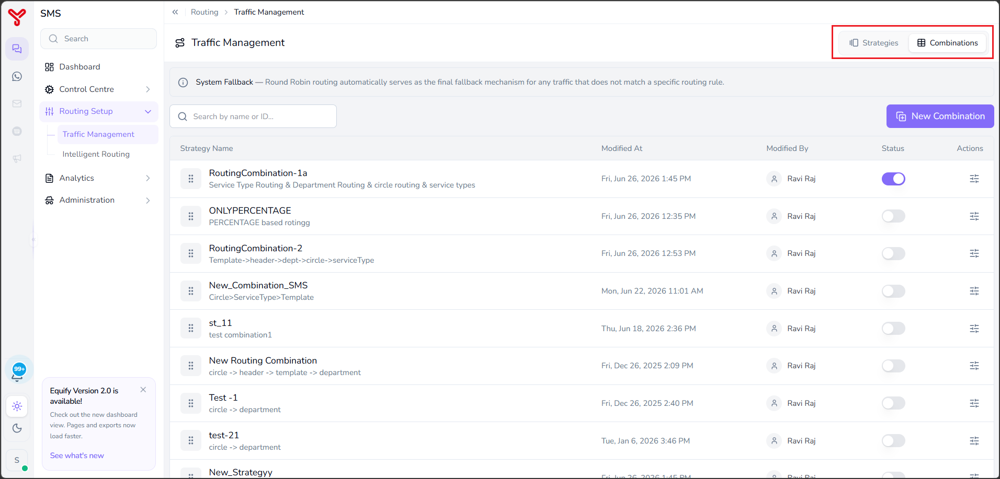
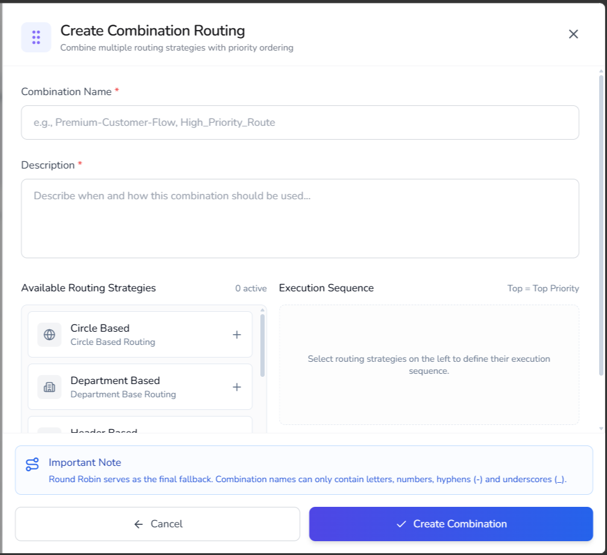

# Create combination routing

---

 Combination routing allows you to combine multiple routing strategies and define the order in which they are evaluated. The system processes routing strategies according to the configured execution sequence. If no routing rule matches, Round Robin routing is used as the final fallback mechanism.

---

## Create a combination routing

1. Navigate to **Routing Setup** > **Traffic Management**.

2. Select the **Combinations** tab.

    

3. Select **New Combination**.

    The **Create Combination Routing** dialog box opens.

4. In the **Combination Name** field, enter a unique name for the routing combination.

    { width="500" }

5. In the **Description** field, enter a description that explains the purpose of the routing combination.

6. Under **Available Routing Strategies**, locate the routing strategies that you want to include.

7. Select the **Add (+)** icon for each routing strategy.

    The selected routing strategies are added to the **Execution Sequence** section.

8. Arrange the routing strategies in the required order.

    The strategy at the top of the list has the highest priority and is evaluated first.

9. Review the execution sequence.

10. Select **Create Combination**.

The routing combination is created and displayed in the Combination Routing list.

!!! Notes
    - Combination names can contain letters, numbers, hyphens (`-`), and underscores (`_`) only.
    - The execution sequence determines the routing evaluation order.
    - Round Robin routing serves as the final fallback mechanism when no routing rule matches.

---

## Enable or disable combination routing

Use this procedure to enable or disable the routing combinations.

### Procedure

1. Navigate to **Routing Setup** > **Traffic Management**.
2. Select the **Combinations** tab.
3. Locate the combination.
4. Use the **Status** toggle.

    - Enable the toggle to activate the combination.
    - Disable the toggle to deactivate the combination.

The routing combination is enabled or disabled for routing.

---

## What to do next

- Modify combinations in [Edit routing combinations](edit_routing_combination.md)
- Monitor routing performance in [Analytics](../analytics/index.md)

  

    <h2 class="support-title">Need some help?</h2>
    

      Communication at scale isn’t always simple. Get instant help from our
      <a href="/support/">support team</a>, or browse the
      <a href="/faq/#faq">FAQ</a> for quick answers.
    

    

      <a href="/terms/">Terms of service</a>
      <a href="/privacy/">Privacy Policy</a>
      © 2026 Equify. All rights reserved.
    

  

  

    

      
🎧

      
💬

      
🛡️

    

  

