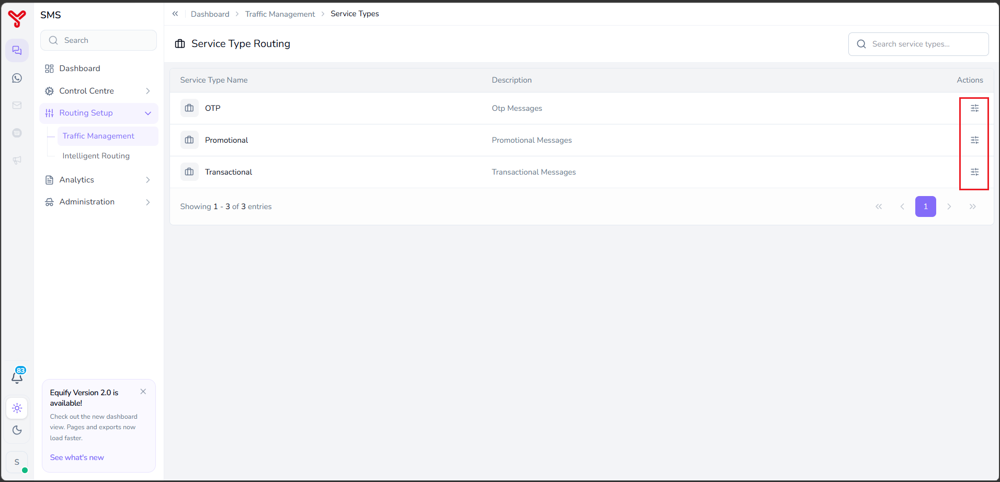
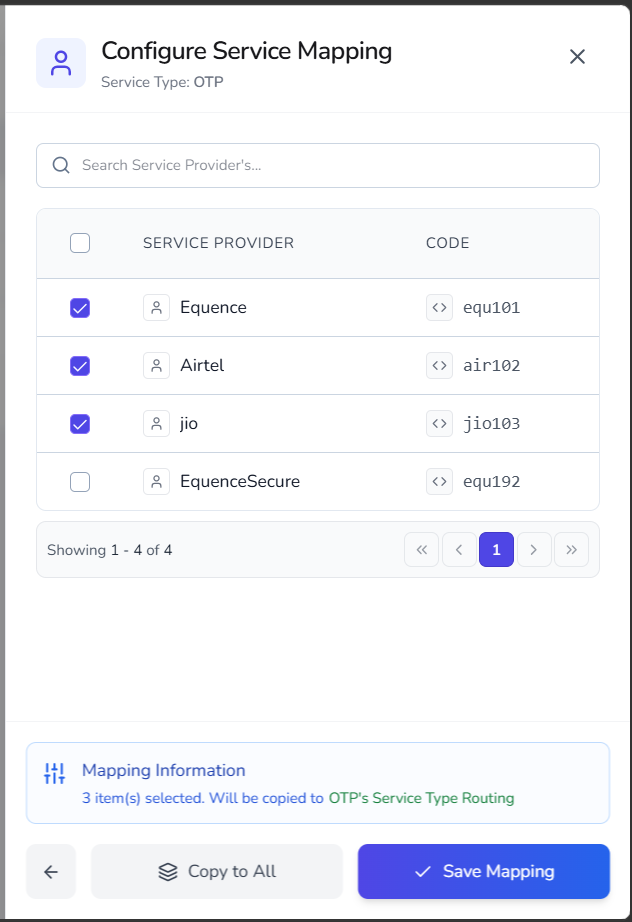

# Service type routing

---

**Service Type Routing** allows you to associate service providers with predefined message service types, such as OTP, Promotional, and Transactional. These mappings determine which service providers are eligible to process messages belonging to a specific service category.

To configure service type routing:

1. Select a service type.
2. Map one or more service providers to the service type.
3. Save the mapping configuration.

---

## Open service type routing

The **Service Type Routing** page opens with the following information.

| Column | Description |
|----------|-------------|
| **Service Type Name** | Name of the service type. |
| **Description** | Description of the message category. |
| **Actions** | Provides access to service provider mapping configuration. |

   

### Available service types

| Service Type | Description |
|-------------|-------------|
| **OTP** | Used for one-time password and verification messages. |
| **Promotional** | Used for marketing and promotional communications. |
| **Transactional** | Used for transactional and service-related notifications. |

### Available actions

| Action | Description |
|----------|-------------|
| **Configure Mapping** | Maps service providers to the selected service type. |

---

## Configure service type mapping

Service type mapping determines which service providers can process messages for a specific service type.

### Procedure

1. Navigate to **Routing Setup > Traffic Management > Service Type Routing**.
2. Locate the required service type.
3. Click the **Configure Mapping** icon.

     

     The **Configure Service Mapping** window displays all available service providers for the selected service type.

4. Select one or more service providers from the list.

     { width="300" }

5. (Optional) Click **Copy to All** to apply the same provider mapping to all service types.
6. Click **Save Mapping**.

The selected service providers are mapped to the service type.

---

## What to do next

- Explore other routing strategies in [Routing overview](index.md)
- Combine strategies in [Create routing combinations](routing-combinations.md)