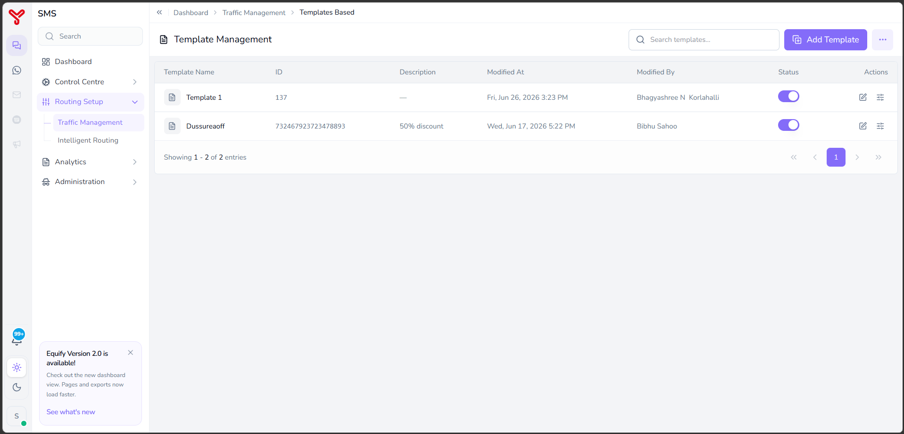
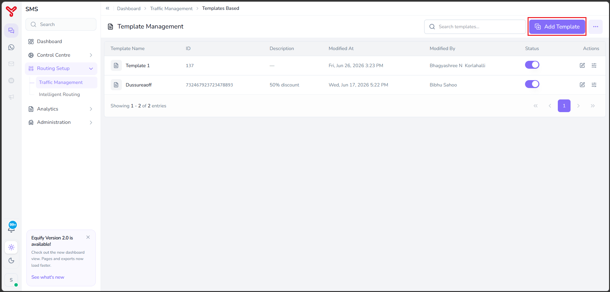
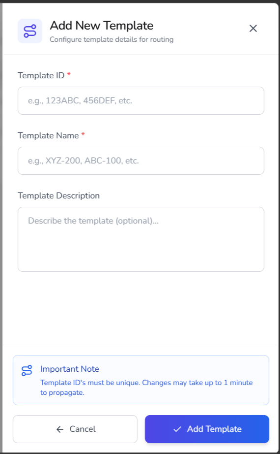
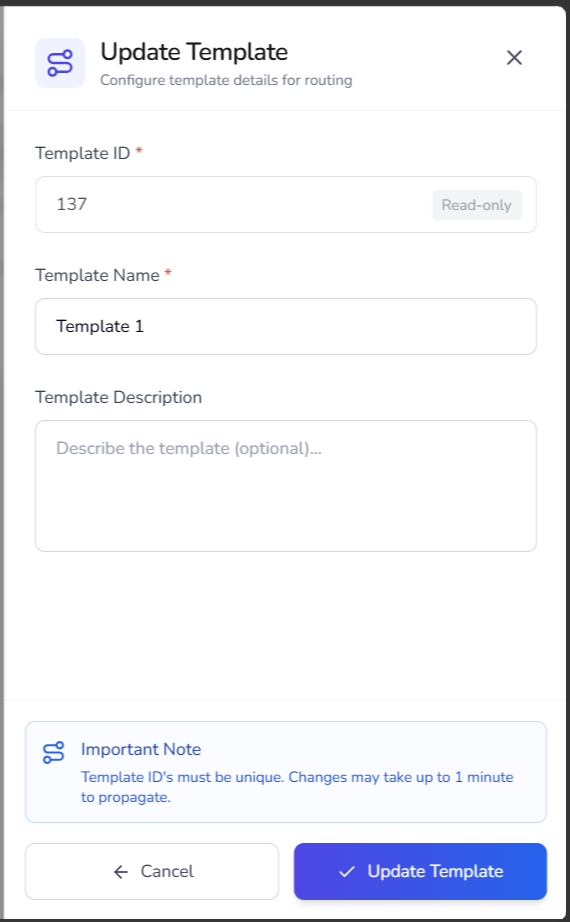
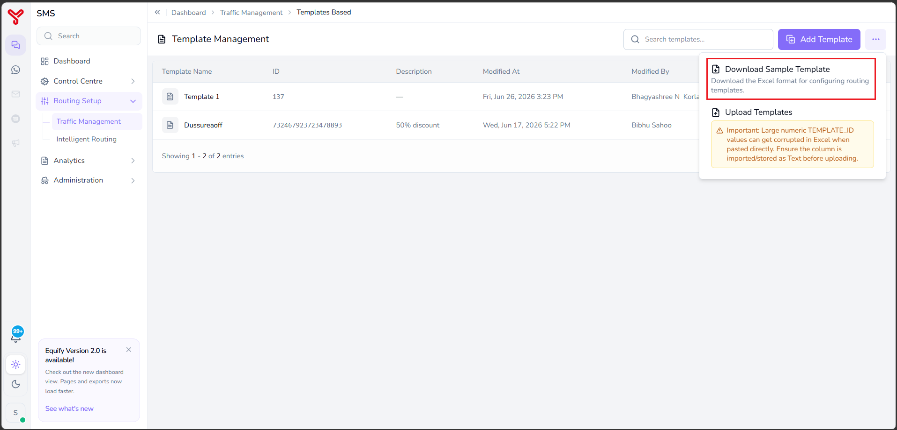
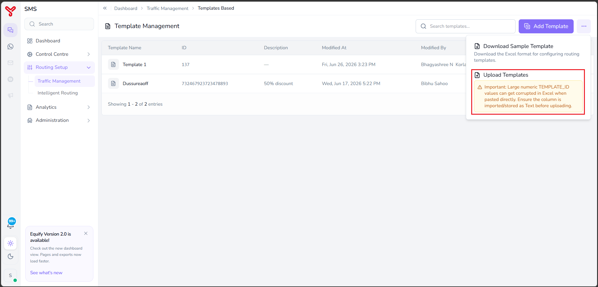
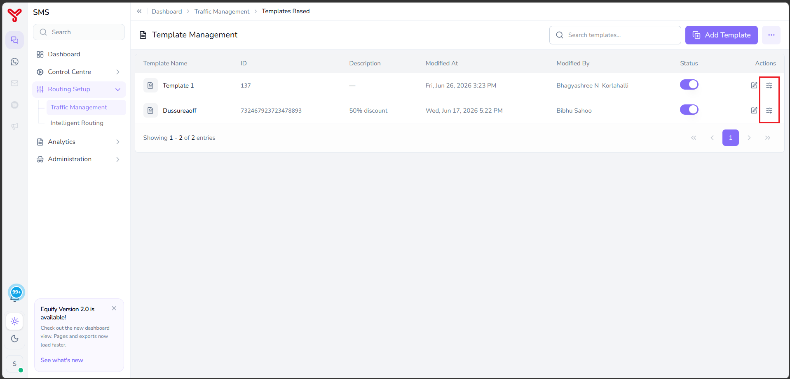
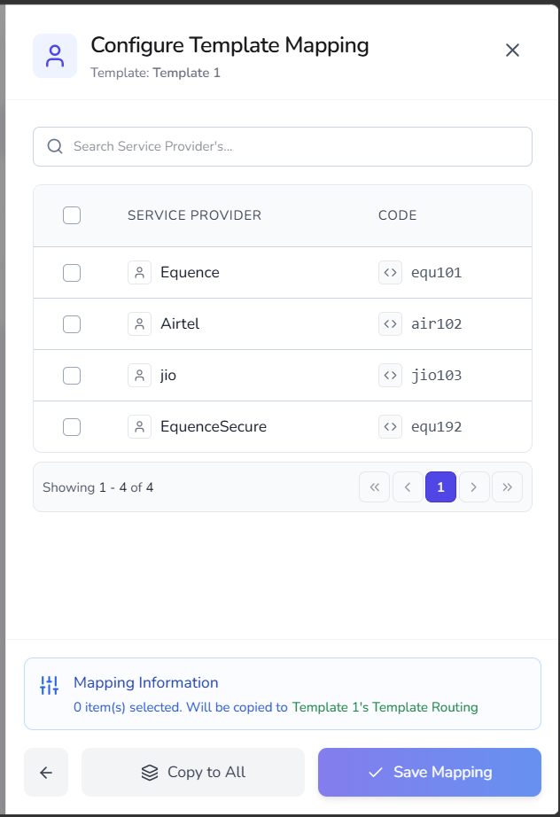

# Template routing

---

**Template Routing** allows users to create and maintain template identifiers used for template-based message routing. Templates can be mapped to one or more service providers to control how traffic is routed when a specific template is used.

To configure template-based routing:

1. Create a template.
2. Map the template to the required service providers.
3. Save the mapping configuration.
4. Enable the template to make it available for routing.

---

## Open template management

1. Navigate to **Routing Setup**.
2. Select **Traffic Management**.
3. Click **Template Routing**.

   

The **Template Management** page opens with the following information:

| Column | Description |
|----------|-------------|
| **Template Name** | Name assigned to the template. |
| **ID** | Unique identifier of the template. |
| **Description** | Additional information about the template. |
| **Modified At** | Date and time when the template was last modified. |
| **Modified By** | User who last modified the template. |
| **Status** | Indicates whether the template is enabled or disabled. |
| **Actions** | Provides options to edit the template and configure template mapping. |

   

### Available actions

| Action | Description |
|----------|-------------|
| **Add Template** | Creates a new template configuration. |
| **Enable or Disable** | Activates or deactivates a template. |
| **Edit** | Updates template details. |
| **Configure Mapping** | Maps service providers to the selected template. |
| **Download Sample Template** | Downloads a sample Excel file for bulk template configuration. |
| **Upload Templates** | Uploads templates in bulk using the supported Excel format. |

---

## Add a template

Use this procedure to create a new template.

### Procedure

1. Navigate to **Routing Setup > Traffic Management > Templates Routing**.
2. Click **Add Template**.

       

3. Enter the required information.

    | Field | Description |
    |---------|-------------|
    | **Template ID** | Unique identifier for the template. |
    | **Template Name** | Name of the template. |
    | **Template Description** | Optional description for the template. |
  
    { width="300" }
  
4. Click **Add Template**.

The template is added to the system and becomes available for mapping.

!!! Note
    Template IDs must be unique. Configuration changes may take up to one minute to propagate.

---

## Update a template

Use this procedure to modify an existing template.

### Procedure

1. Locate the template in the template list.
2. Click the **Edit** icon.
3. Update the required fields.

    | Field | Description |
    |---------|-------------|
    | **Template ID** | Read-only field that identifies the template. |
    | **Template Name** | Name of the template. |
    | **Template Description** | Optional description for the template. |

    { width="300" }

4. Click **Update Template**.

The updated configuration is saved.

---

## Bulk template upload

### Download the sample template

1. Click the **More Options** menu.
2. Select **Download Sample Template**.

     

3. Save the Excel file.

### Upload templates

1. Click the **More Options** menu.
2. Select **Upload Templates**.

     

3. Choose the completed Excel file.
4. Upload the file.

The system imports the template configuration and makes the templates available for routing.

---

## Configure template mapping

Template mapping determines which service providers can process traffic for a specific template.

### Procedure

1. Locate the required template.
2. Click the **Configure Mapping** icon.

     

3. Select one or more service providers.

    | Field | Description |
    |---------|-------------|
    | **Service Provider** | Name of the service provider available for mapping. |
    | **Code** | Unique code assigned to the service provider. |

    { width="300" }

4. Select the required service providers.

5. (Optional) Click **Copy to All** to apply the same provider selection to all added templates.
5. Click **Save Mapping**.

The selected service providers are mapped to the template.

---

## Enable or disable a template

Use the **Status** toggle to enable or disable a template.

### Enable a template

1. Locate the template.
2. Turn the **Status** toggle on.

The template becomes available for routing.

### Disable a template

1. Locate the template.
2. Turn the **Status** toggle off.

The template is excluded from routing until it is enabled again.

---

## What to do next

- Explore other routing strategies in [Routing overview](index.md)
- Combine strategies in [Create routing combinations](routing-combinations.md)

  

    <h2 class="support-title">Need some help?</h2>
    

      Communication at scale isn’t always simple. Get instant help from our
      <a href="/support/">support team</a>, or browse the
      <a href="/faq/#faq">FAQ</a> for quick answers.
    

    

      <a href="/terms/">Terms of service</a>
      <a href="/privacy/">Privacy Policy</a>
      © 2026 Equify. All rights reserved.
    

  

  

    

      
🎧

      
💬

      
🛡️

    

  

