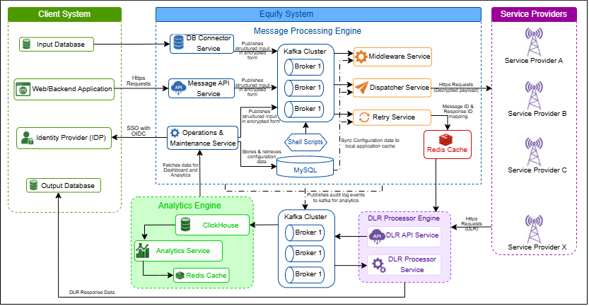

## Architecture Overview

Equify is a communication orchestration platform that provides a centralized framework for managing business communications across enterprise applications, data sources, and messaging providers. It enables organizations to route, deliver, monitor, and analyze communication traffic through a single platform rather than managing multiple provider integrations independently.

The platform acts as an intermediary layer between business systems and messaging providers. Communication requests are received from business applications and source systems, processed according to configured routing policies, delivered through the appropriate messaging provider, and tracked throughout the delivery process. Operational metrics, delivery outcomes, and audit information are made available through centralized monitoring and reporting capabilities.

This architecture provides:

- Centralized communication management
- Multi-provider and multi-channel connectivity
- Configurable routing strategies
- Automated retry and failover processing
- Delivery lifecycle tracking
- Real-time operational monitoring
- Infrastructure health monitoring
- Centralized governance and auditability
- Support for large-scale communication workloads

At a high level, the Equify architecture consists of three logical domains:

| Domain | Purpose |
|------------|-------------|
| Client System | Generates communication requests and receives delivery status updates |
| Equify Platform | Processes, routes, monitors, and tracks communications |
| Service Providers | Deliver messages to end recipients |

## Equify Platform Architecture

*Figure 1. High-level architecture of the Equify platform.*

## Architectural Domains

### Client System

The Client System represents the business applications and databases that generate communication requests.

Equify supports two integration models:

- API-based integration through the Message API Service
- Database-based integration through the DB Connector Service

For database-driven implementations, Equify can monitor client databases through scheduled polling or Debezium-based Change Data Capture (CDC), enabling real-time message ingestion without requiring application changes.

The client environment may include:

- Identity Provider (IDP) for user authentication
- Input databases that generate message requests
- Output databases that receive final delivery status information

### Equify Platform

The Equify Platform is responsible for communication orchestration and contains three major processing engines:

- Message Processing Engine
- Delivery Status Processing Engine
- Analytics Engine

Together, these engines manage message delivery, delivery report processing, monitoring, analytics, and operational governance.

### Service Providers

Service Providers are external messaging providers responsible for delivering communications to end recipients.

Equify can communicate with multiple providers simultaneously and determines the appropriate provider based on configured routing policies and operational requirements.

Depending on the configured communication channel, providers may support SMS, WhatsApp, or other messaging services integrated with Equify.

This architecture allows organizations to distribute traffic, implement failover strategies, and reduce dependency on a single provider.

---

## Message Processing Engine

The Message Processing Engine is responsible for receiving, validating, routing, and dispatching messages.

The engine includes a set of services responsible for message ingestion, validation, routing, and delivery.

### Integration Layer

The Integration Layer serves as the entry point into the platform.

Communication requests can enter Equify through either business applications or database-driven workflows.

### Message API Service

The Message API Service provides a secure HTTPS interface that allows enterprise applications to submit message requests to Equify.

Incoming requests are validated and transformed into a standardized internal format before entering the processing pipeline.

### DB Connector Service

The DB Connector Service supports database-driven communication workflows.

This service retrieves records directly from client databases or consumes database change events published through Debezium CDC, converting them into structured message requests for processing.

### Kafka Cluster

Kafka provides the messaging infrastructure used by Equify to exchange events between platform services.

After validation, all message requests are published to Kafka topics where they become available to downstream services. This asynchronous architecture enables scalable and fault-tolerant message processing across the platform.

### Middleware Service

The Middleware Service performs business-rule validation and routing evaluation.

Based on configured routing strategies, the service determines which provider should receive the message and publishes the request to the appropriate provider-specific processing channel.

### Delivery Management Layer

The Delivery Management Layer is responsible for selecting providers and dispatching messages.

### Dispatcher Service

The Dispatcher Service consumes routed messages and transforms them into provider-specific request formats.

The service invokes the provider's HTTPS APIs and submits the message for delivery.

### Retry Service

The Retry Service manages delivery failures.

When a provider returns a retryable error, the service automatically routes the message to an alternate provider based on configured retry policies and fallback routing rules.

### Routing Architecture

Routing determines how communication traffic is distributed across configured messaging providers.

The platform supports multiple routing strategies that determine how traffic is distributed across service providers.

Supported routing strategies include:

- Round Robin Routing
- Percentage-Based Routing
- Department-Based Routing
- Header-Based Routing
- Circle-Based Routing (Geographic Routing)

Routing behavior is determined by the routing strategy configured by platform administrators.

Organizations can select the routing approach that best aligns with operational, business, and regulatory requirements.

---

## Delivery Report Processing Layer

The Delivery Report Processing Layer manages message status updates received from service providers.

### Delivery Status Processing Engine

The Delivery Status Processing Engine manages delivery acknowledgements and status updates received from messaging providers.

For SMS channels, status information is typically received through Delivery Reports (DLRs). Other supported channels may provide equivalent delivery status events through channel-specific mechanisms.

### DLR API Service

Messaging providers send delivery reports back to Equify through dedicated API endpoints.

These reports contain status information that indicates whether messages were delivered successfully, failed, expired, or encountered processing issues.

Received DLR payloads are validated and published to Kafka for processing.

### DLR Processor Service

The DLR Processor consumes delivery report events from Kafka.

The service:

- Retrieves the corresponding message identifier from Redis.
- Correlates the provider response with the original message.
- Consolidates delivery information.
- Updates the configured output destination.

Depending on configuration, delivery status information can be:

- Updated in the client input database
- Inserted into an output database
- Written to CSV files for downstream processing

---

## Analytics and Operations Layer

The Analytics and Operations Layer provides visibility into communication activity, platform performance, and infrastructure health.

It transforms messaging events, delivery information, audit logs, and operational metrics into dashboards, reports, alerts, and monitoring insights that support day-to-day operations and platform administration.

### ClickHouse Analytics Store

All audit logs and operational metrics are published to Kafka and ingested into ClickHouse for long-term analytics processing.

The platform stores:

- Messaging activity
- Delivery statistics
- Retry information
- Audit logs
- System health metrics
- Application performance metrics

### Redis Cache

Redis is used as the platform's in-memory data store for runtime processing.

Frequently accessed configuration data, routing information, and message correlation data are maintained in Redis to support low-latency processing across platform services.

### System Metrics Collection

Background monitoring scripts execute periodically across all servers and collect metrics related to:

- CPU utilization
- Memory utilization
- Network health
- Kafka status
- Redis status
- Database status
- Application availability

The collected data is published to Kafka and processed by ClickHouse for reporting purposes.

### Analytics Processing

Communication activity and operational events are processed through a dedicated analytics engine.

The analytics layer aggregates information from across the platform and prepares it for dashboards, reports, and log analysis.

### Dashboard and Reporting Services

In addition to communication metrics, Equify provides visibility into platform and infrastructure health. Operations teams can monitor resource utilization, service availability, messaging infrastructure status, and database health from a centralized monitoring interface.

Reporting capabilities help organizations analyze:

- Message volumes
- Delivery trends
- Provider performance
- Failure patterns
- Operational activity
- Audit information
- Infrastructure utilization
- Service availability and platform health

These dashboards help operations teams monitor communication activity, investigate delivery issues, and evaluate provider performance.

---

## End-to-End Communication Flow

The following sequence summarizes the complete communication lifecycle:

1. A business application or database generates a message request.
2. Equify receives the request through the Message API Service or DB Connector Service.
3. The request is validated and published to Kafka.
4. Routing policies determine the target provider.
5. The Dispatcher Service submits the message to the selected provider.
6. Retry processing handles temporary failures when required.
7. Messaging providers return delivery status updates and acknowledgements.
8. The Delivery Status Processing Engine correlates and processes delivery status information.
9. Final delivery results are written to the configured output destination.
10. Audit events and operational metrics are processed by the Analytics Engine.
11. Dashboards, reports, and logs provide operational visibility into the complete messaging lifecycle.