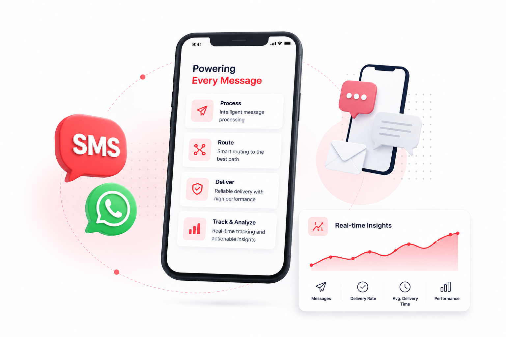

---
hide:
  - toc
---

<h1 class="hero-title">Communication Orchestration Platform</h1>

Equify centralizes communication processing, provider management, 
routing, monitoring, analytics, and governance for SMS and WhatsApp 
communications at scale.

<a href="#get-started" class="hero-btn">
<strong>Get Started →</strong>
</a>

<a href="#sms-modules" class="hero-btn">
<strong>SMS Module →</strong>
</a>

<a href="#whatsapp-modules" class="hero-btn">
<strong>Whatsapp Module →</strong>
</a>

Version 5.2.1 • Released 30 June 2026 •
<a href="release_notes/">Release Notes</a>

Get started

Start building scalable, intelligent SMS workflows in minutes.

<h3>About Equify</h3>

Learn how Equify manages communication processing, routing, delivery tracking, and operational monitoring.

<a href="Product_Guide/overview1/#introduction" class="card-link">
Explore Overview →
</a>

<h3>Installation & Setup</h3>

Set up Equify and prepare the platform for enterprise messaging operations.

<a href="Product_Guide/installation/#introduction" class="card-link">
Start Setup →
</a>

SMS Modules

Find everything you need to build, manage, and scale your SMS experience.

<a href="SMS/analytics/#analytics" class="card-btn">
<strong>View Analytics →</strong>
</a>

<a href="SMS/administration/#admin" class="card-btn">
<strong>Administration →</strong>
</a>

<h3>Dashboard</h3>

Monitor messaging activity, delivery performance, failures, retries, and platform health.

<a href="SMS/dashboard/dashboard_index/#dashboard" class="explore-link">
Open Dashboard →
</a>

<h3>Control Centre</h3>

Manage databases, providers, configurations, and operational settings from a centralized console.

<a href="SMS/control-centre/#control_centre" class="explore-link">
Manage Platform →
</a>

<h3>Routing Setup</h3>

Configure intelligent routing strategies using provider allocation, headers, templates, geography, service type, and failover rules.

<a href="SMS/routing-setup/#routing" class="explore-link">
Configure Routing →
</a>

Whatsapp Modules

Find everything you need to build, manage, and scale your WhatsApp experience.

<a href="whatsapp/analytics/#analytics" class="card-btn">
<strong>View Analytics →</strong>
</a>

<a href="whatsapp/administration/#admin" class="card-btn">
<strong>Administration →</strong>
</a>

<h3>Dashboard</h3>

Monitor messaging activity, delivery performance, failures, retries, and platform health.

<a href="whatsapp/dashboard/dashboard_index/#dashboard" class="explore-link">
Open Dashboard →
</a>

<h3>Control Centre</h3>

Manage databases, providers, configurations, and operational settings from a centralized console.

<a href="whatsapp/control-centre/#control_centre" class="explore-link">
Manage Platform →
</a>

<h3>Template Management</h3>

Register and manage provider-approved WhatsApp templates used for business communications.

<a href="whatsapp/template-management/#template_management" class="explore-link">
Manage Templates →
</a>

  

    <h2 class="support-title">Need some help?</h2>
    

      Communication at scale isn’t always simple. Get instant help from our
      <a href="https://equence.com/contact.html">support team</a>, or browse the
      <a href="../faq/#faq">FAQ</a> for quick answers.
    

    

      <a href="https://equence.com/terms.html">Terms of service</a>
      <a href="https://equence.com/privacy-policy.html">Privacy Policy</a>
      © 2026 Equify. All rights reserved.
    

  

  

    

      
🎧

      
💬

      
🛡️

    

  

