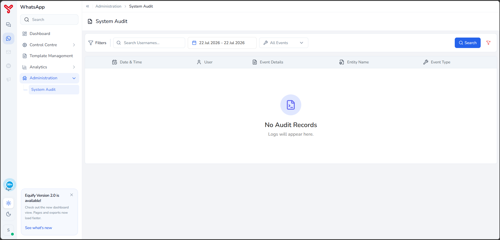

# Administration overview {#admin}

**Administration** section provides access to audit information for configuration changes made within Equify. Use this section to review system activities, track configuration updates, and identify who performed specific actions.

## Open administration

1. In the left-hand navigation menu, select **Administration**.
2. Select **System Audit**.

---

## What to do next

- Review system activity in [System audit](system-audit.md)

  

    <h2 class="support-title">Need some help?</h2>
    

      Communication at scale isn’t always simple. Get instant help from our
      <a href="https://equence.com/contact.html">support team</a>, or browse the
      <a href="../../faq/#faq">FAQ</a> for quick answers.
    

    

      <a href="https://equence.com/terms.html">Terms of service</a>
      <a href="https://equence.com/privacy-policy.html">Privacy Policy</a>
      © 2026 Equify. All rights reserved.
    

  

  

    

      
🎧

      
💬

      
🛡️

    

  

