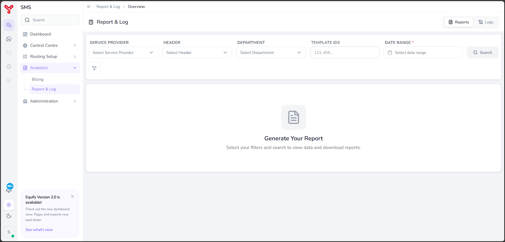

# WhatsApp Analytics overview {#analytics}

---

**Analytics** provides access to reporting and message tracking capabilities for WhatsApp communications in Equify. Use Analytics to review messaging activity, generate reports, monitor delivery performance, and investigate message-level details.

Analytics enables you to analyze historical WhatsApp communication data and retrieve records for operational monitoring, auditing, and troubleshooting.

---

## Open analytics

1. In the left navigation pane, select **Analytics**.
2. Expand the **Analytics** menu to view the available sections:
   - **Billing**
   - **Report & Log**

    

---

## Analytics sections

| Section | Description |
|----------|-------------|
| **Billing** | View billing-related information and platform usage details for WhatsApp communications. |
| **Report & Log** | Generate WhatsApp reports and search detailed message delivery logs. |

---

## Billing

The **Billing** section provides access to billing and usage information associated with WhatsApp messaging and platform consumption.

!!! Note
    Billing functionality will be available in a future release.

---

## Report & Log

The **Report & Log** section provides tools to analyze WhatsApp messaging activity and investigate delivery behavior.

This section contains two tabs:

| Tab | Description |
|------|-------------|
| **Reports** | Generate summary reports using filters such as service provider, sender, template ID, and date range. Export the results for further analysis. |
| **Logs** | Search individual message records and review detailed delivery information, including message status and processing details. |

Use **Reports** to monitor overall communication performance and identify trends. Use **Logs** when you need to investigate a specific message or delivery event in detail.

---

## What to do next

- View detailed reports in [Report & log](report-and-log.md)

  

    <h2 class="support-title">Need some help?</h2>
    

      Communication at scale isn’t always simple. Get instant help from our
      <a href="https://equence.com/contact.html">support team</a>, or browse the
      <a href="../../faq/#faq">FAQ</a> for quick answers.
    

    

      <a href="https://equence.com/terms.html">Terms of service</a>
      <a href="https://equence.com/privacy-policy.html">Privacy Policy</a>
      © 2026 Equify. All rights reserved.
    

  

  

    

      
🎧

      
💬

      
🛡️

    

  

