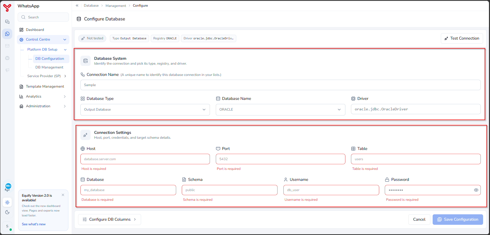
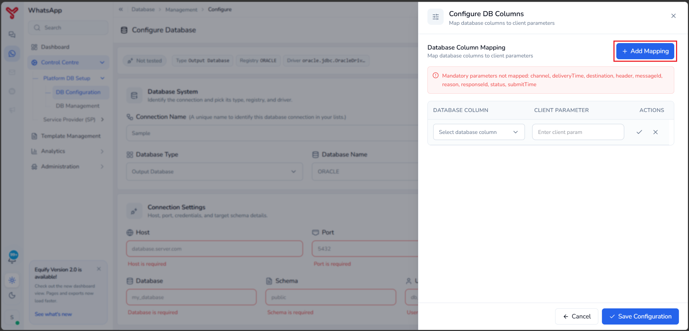
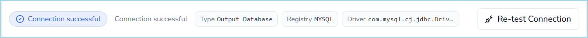

# Configure a database connection

---

The **DB Configuration** feature is used to connect a client database to the Equify WhatsApp platform.

WhatsApp communication requests are submitted exclusively through APIs and are not read from a client database.

Database connections are primarily used to store platform configuration data and to write message delivery status information back to client systems for reporting and downstream processing.

---

## Prerequisites

Before you begin, ensure you have the following:

- Database server hostname or IP address
- Port number
- Database name
- Schema name
- Table name
- Database username and password
- Database columns used to store delivery status information

---

## Create a database configuration

1. Navigate to **Control Centre > Platform DB Setup > DB Configuration**.

2. In the **Database System** section, enter the connection details.
    - **Connection Name**: A unique name for the database connection.
    - **Database Type**: Select the database role as **Output Database**.
    - **Database Name**: Select the registered database.
    - **Driver**: Displays the database driver associated with the selected database. This field is populated automatically.

    !!! note
        **Output Database** – Equify writes delivery status information and delivery reports, and message lifecycle updates back to the database.

3. In the **Connection Settings** section, provide the database connection information.
    - **Host**: Database server hostname or IP address.
    - **Port**: Database listener port.
    - **Table**: Database table used by Equify.
    - **Database**: Database name.
    - **Schema**: Database schema name.
    - **Username**: Database user account.
    - **Password**: Password for the database user account.

    

4. Select **Configure DB Columns**.

5. In the **Configure DB Columns** panel, map database columns to the corresponding client parameters.

6. Select **Add Mapping**.

    

7. For each required parameter:
   
    a. Select the database column from the **Database Column** list.  
    b. Enter the corresponding client parameter in the **Client Parameter** field.  
    c. Save the mapping.

8. Continue adding mappings until all mandatory parameters are mapped.

    !!! note

        The platform displays a warning message for any required parameters that have not been mapped.

9. Select **Save Configuration** in the **Configure DB Columns** panel.

    The mappings are saved and the **DB Configuration** page is displayed.

10. Select **Test Connection**.

11. Wait for the validation process to complete.

12. Verify that the **Connection Status** panel shows a successful connection.

    !!! note

        If the test fails, review the connection details and database credentials before testing again.
    { width:"1000" }

13. Select **Save Configuration**.

14. Verify that the new database configuration appears in the configured database list.

    The database connection is now available for use by the Equify.

!!! Note
    By default, a newly created DB configuration is inactive. To activate the created database configuration, navigate to **Control Centre > Platform DB Setup > DB Management**, and then enable the toggle switch corresponding to the required database configuration.

---

## What to do next

- Verify configuration in [View DB configuration](view-db-configuration.md)
- Update settings if needed in [Update DB configuration](update-db-configuration.md)
- Continue setup in [Service provider registration](service-provider-registration.md)

  

    <h2 class="support-title">Need some help?</h2>
    

      Communication at scale isn’t always simple. Get instant help from our
      <a href="https://equence.com/contact.html">support team</a>, or browse the
      <a href="../../../faq/#faq">FAQ</a> for quick answers.
    

    

      <a href="https://equence.com/terms.html">Terms of service</a>
      <a href="https://equence.com/privacy-policy.html">Privacy Policy</a>
      © 2026 Equify. All rights reserved.
    

  

  

    

      
🎧

      
💬

      
🛡️

    

  

