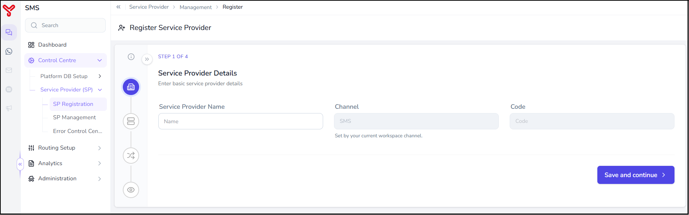
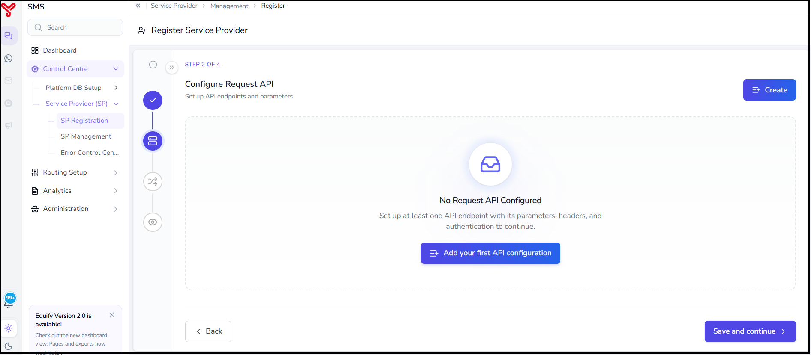
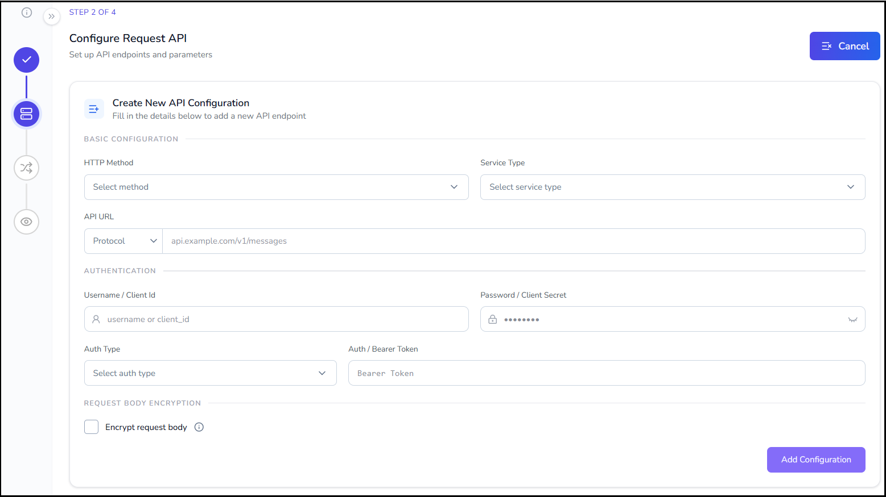
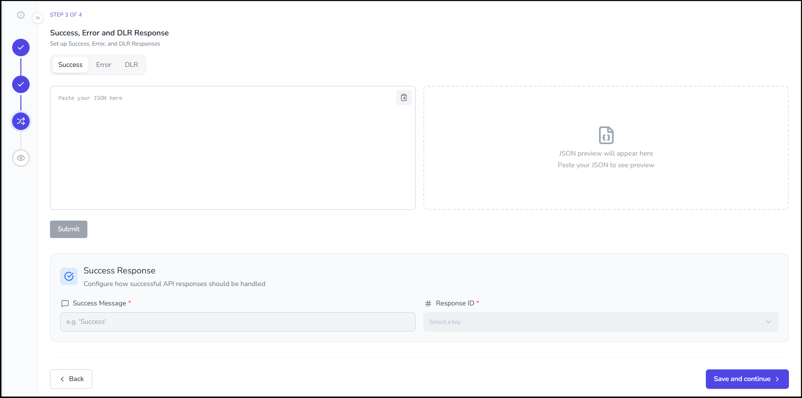
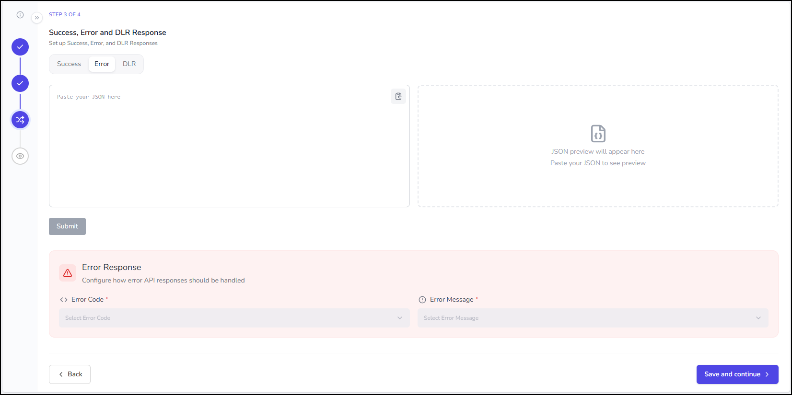
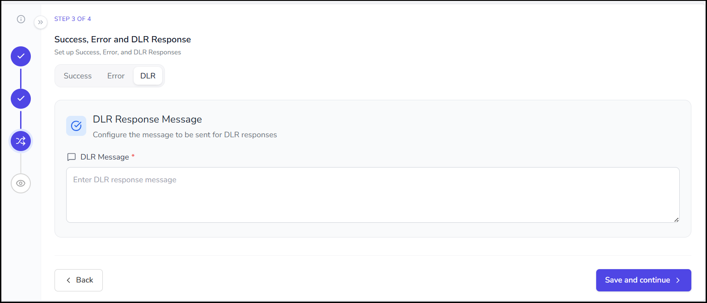

# Service provider registration

---

The WhatsApp Service Provider registration allows user to connect Equify with a WhatsApp Business service provider.

This integration enables Equify to send WhatsApp messages, receive delivery and read status updates, process inbound customer messages, and manage interactive WhatsApp conversations through a single platform.

During registration, administrators configure the provider endpoint, authentication details, WhatsApp Business Account (WABA) information, request mappings, and response handling rules required for communication with the provider.

Once the configuration is completed and activated, the provider becomes available for WhatsApp message delivery.

---

## Before you begin

Ensure that you have the following information from your WhatsApp service provider:

- Service provider name
- API endpoint URL
- HTTP method (GET or POST)
- WhatsApp Business Account (WABA)
- Authentication credentials
- Request parameters and headers
- Success response format
- Error response format
- DLR (Delivery Receipt) response format

---

## Register a Service provider

1. Navigate to **Control Centre › Service Provider (SP) › SP Registration**.
2. The **Register Service Provider** wizard opens, showing four steps:
    1. **Service Provider Details**: enter basic service provider information
    2. **Configure Request API**: set up API endpoints and parameters
    3. **Success, Error and DLR / Read / MO / CTA Response**: set up success, error, and DLR response handling
    4. **Preview**: review your information

    !!! Note
        Completed steps remain accessible. You can return to a previous step to modify the configuration without losing your progress.

=== "Step 1"

    ## Service Provider Details

    In this step, provide the basic details of the service provider.

    | Field | Description |
    | --------------------- | --------------- |
    | **Service Provider Name** | Enter a unique name to identify the service provider. |
    | **Channel** | Displays the current workspace channel. This value is automatically populated. |
    | **Code** | Displays the unique provider code. This value is automatically generated.      |

     

    ### Procedure

      1. Enter the **Service Provider Name**.
      2. Verify the automatically populated **Channel** and **Code values**.
      3. Click **Save and continue**.

      The service provider details are saved successfully.

=== "Step 2"

    ## Configure Request API

    In this step, configure the API endpoint that Equify uses to submit messages to the service provider.

    !!! Note
        Set up at least one API endpoint with its parameters, headers, and authentication to continue.

     

    **Create an API Configuration**

      1. Click **Create** or **Add your first API configuration**.
      2. The **Create New API Configuration** screen opens.
     

      3. Select the HTTP method from the **HTTP Method** dropdown.

        === "POST"

            Select **POST** when the provider expects message data in the request body.

            POST requests support:

            - JSON request body
            - Parameter mapping
            - Request body encryption

        === "GET"

            Select **GET** when the provider expects parameters in the URL query string.

            GET requests:

            - Do not require a JSON request body
            - Pass parameters through URL query parameters

      4. Select either **http://** or **https://** from the **Protocol** dropdown.
      5. Enter the API URL in the **URL** field.
      6. Select the authentication method from the **Auth Type** dropdown.
      
        === "Basic Auth"

            Use Basic Authentication when the provider requires a username and password.

            | Field | Description |
            |---------|-------------|
            | Username / Client ID | Provider username or client identifier |
            | Password / Client Secret | Provider password or secret |

        === "Bearer Auth"

            Use Bearer Authentication when the provider requires a bearer token.

            | Field | Description |
            |---------|-------------|
            | Bearer Token | Authentication token supplied by the provider |

      8. Select **Encrypt request body** if the service provider requires encrypted request payloads.
      9. Enter the WhatsApp Business Account (WABA) ID assigned by Meta in the **WABA ID** field.
      10. Select the country code and enter the WhatsApp-enabled business number used for message delivery.
      11. Click **Add Configuration**.

        !!! Note
            Add multiple API configuration as required.

        After creating the API configuration, the **Configure API Request** window opens.

    ---

    ### Configure API request

    Request mapping defines how Equify message parameters are translated into the provider-specific API request format.

      1. In the Body tab:

        1. Enter a sample JSON request structure provided by the WhatsApp service provider.

          

        2. Verify that the JSON preview is generated successfully.
        3. Click **Add Mapping**.
        4. Select a **System Parameter**.
        5. Select the corresponding **Client Parameter**.
        6. Repeat the process until all required parameters are mapped.

            !!! warning
                All mandatory parameters must be mapped before the configuration can be saved.

      2. Select the Header tab.
        1. Click **Add Mapping**.
        2. Select a **System Header**.
        3. Select the corresponding **Client Parameter**.
        4. Repeat the process until all required parameters are mapped.

      3. Select the URL tab.

        1. Click **Add Mapping**.
        2. Select a **System URL Param**.
        3. Select the corresponding **Client Parameter**.
        4. Repeat the process until all required parameters are mapped.

      4. Click **Save changes**.

        The request API configuration is saved successfully.
      
        You can create additional API configurations by clicking **Create** in the upper-right corner of the screen.

      5. Click **Save and continue**.

      The request API configuration is saved successfully.

=== "Step 3"

    ## Success, Error and DLR / Read / MO / CTA Response

    In this step, configure how Equify interprets responses received from the service provider.

    Response mapping enables Equify to correctly process message submissions, delivery receipts, read receipts, inbound messages, and call-to-action events.

     

    === "Success"

        1. In the **Success** tab, paste a sample successful API response received from the provider.
        2. Click **Submit**.
        4. In the **Success Response** section:

            1. **Success Message**: Enter the success indicator returned by the provider.
            2. **Response ID**: Select the parameter that contains the provider message identifier.

        5. Click **Save and Continue**.

    === "Error"

        1. Select the **Error** tab.

            

        2. Paste a sample error response returned by the provider.
        2. Click **Submit**.
        3. In the Error Response section, configure the following fields::

            | Field | Description |
            |---------|-------------|
            | **Error Code** | Select the response field that contains the provider error code. |
            | **Error Message** | Select the response field that contains the provider error description. |

        4. Click **Save and Continue**.

    === "DLR"

        Delivery receipt mapping allows Equify to track WhatsApp message delivery status updates.

        1. Select the **DLR** tab.

            

        2. Paste a sample delivery callback payload received from the provider.
        3. Click **Submit**.
        4. In the **DLR Mapping Configuration** section, map the required response fields.
        5. In the **Status Event Mapping** section, map provider delivery status values to Equify status values.
        6. Click **Save and continue**.

    === "Read"

        Read receipt mapping allows Equify to track when WhatsApp users read messages.

        1. Select the **Read** tab.
        2. Paste a sample read-event payload.
        3. Click **Submit**.
        4. In the **Status Event Mapping** section, map provider delivery status values to Equify status values.
        5. In the **Read Mapping Configuration** section, configure the status mapping value for the **Read** event.
        6. Click **Save and Continue**.

    === "MO (Mobile Originated)"

        MO configuration allows Equify to process inbound WhatsApp messages received from end users.

        1. Select the **MO** tab.
        2. Paste a sample inbound message payload.
        3. Click **Submit**.
        4. In the **MO Mapping Configuration** section, map system parameters to your MO response keys.
        5. Click **Save and Continue**.

    === "CTA"

        CTA configuration allows Equify to process customer interactions with WhatsApp call-to-action buttons.

        1. Select the **CTA** tab.
        2. Paste a sample CTA callback payload.
        3. Click **Submit**.
        4. In the **CTA Mapping Configuration** section, map system parameters to your CTA response keys.
        5. Click **Save and Continue**.

=== "Step 4"

    ## Review and Complete

    Review all configured information before completing the registration.

    Verify the following:

    - Service provider details
    - Request API configuration
    - Authentication settings
    - Request mapping
    - Success response mapping
    - Error response mapping
    - DLR response mapping
    - Read response mapping
    - MO response mapping
    - CTA response mapping

    ### Complete Registration

    1. Review all information carefully.
    2. Click **Submit**.

---

The service provider is registered successfully and becomes available in:

  - **SP Management**
  - **Template Management**

!!! tip
    Send a test message after registration to verify connectivity, authentication, request mappings, and response processing.
---

## What to do next

- Manage providers in [Service provider management](service-provider-management.md)
- Add templates in [Add Template](../add-template/index.md)

  

    <h2 class="support-title">Need some help?</h2>
    

      Communication at scale isn’t always simple. Get instant help from our
      <a href="/support/">support team</a>, or browse the
      <a href="/faq/#faq">FAQ</a> for quick answers.
    

    

      <a href="/terms/">Terms of service</a>
      <a href="/privacy/">Privacy Policy</a>
      © 2026 Equify. All rights reserved.
    

  

  

    

      
🎧

      
💬

      
🛡️

    

  

