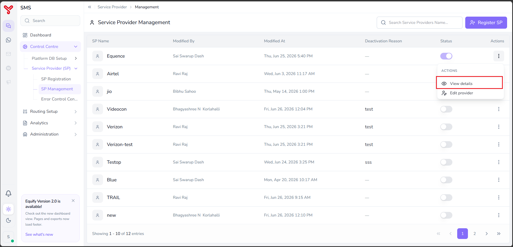

# View service provider details

---

User can view the registered service provider details using **SP Management** feature. This guide describes the procedure for viewing the service provider registration details.

---

## To view SP details

1. Navigate to **Control Centre > Service Provider (SP) > SP Management**.

    The **SP Management** screen lists registered service providers with the following information:

    | Column | Description |
|---|---|
| **SP Name** | The provider's registered name, for example `Equence`, `Airtel`, `Jio`, or `Videocon` |
| **Modified By** | The user who last changed this provider's configuration. |
| **Modified At** | When that change was made. |
| **Deactivation Reason** | A free-text note explaining why a provider was disabled, if applicable, or `—` if the provider has never been deactivated. |
| **Status** | Toggle switch showing whether the provider is currently active (ON) or inactive (OFF). |
| **Actions** | A menu (⋮) offering options to edit, view, or copy callback URLs the specific service provider. |

2. Click the **Actions** menu (⋮) of the SP registration that you want to view details.

    

The **Service Provider Details** screens opens and displays the complete configuration information for the selected service provider.

!!! note
    * User can register a new service provider by clicking **New Service Provider** in the top-right corner of the screen. For more information, refer to *[SP registration](service-provider-registration.md)*.
    * User can update an existing service provider registration by clicking **Edit** in the top-right corner of the screen. For more information, refer to *[Update service provider details](service-provider-management.md)*.

---

## Related articles

- [Update service provider](service-provider-management.md)
- [Service provider registration](service-provider-registration.md)

  

    <h2 class="support-title">Need some help?</h2>
    

      Communication at scale isn’t always simple. Get instant help from our
      <a href="https://equence.com/contact.html">support team</a>, or browse the
      <a href="../../../faq/#faq">FAQ</a> for quick answers.
    

    

      <a href="https://equence.com/terms.html">Terms of service</a>
      <a href="https://equence.com/privacy-policy.html">Privacy Policy</a>
      © 2026 Equify. All rights reserved.
    

  

  

    

      
🎧

      
💬

      
🛡️

    

  

