# Dashboard Overview {#dashboard}

---

The Dashboard is the landing page of the Equify SMS platform. It provides a centralized view of messaging activity, provider performance, system health, and application status. It helps users monitor real-time operations and identify issues quickly.

Dashboard allows users to quickly identify trends, monitor ongoing operations, and investigate issues without navigating through multiple areas of the application.

---

## Dashboard Components

The dashboard is organized into several sections that provide visibility into different aspects of SMS operations.

### Summary Metrics

The summary cards displayed at the top of the page provide an immediate view of key operational metrics for the current day.

  

The metrics include:

* **Total SMS Sent Today** – Displays the total number of SMS messages sent on the current day.
* **Delivery Rate** – Percentage of successfully delivered messages.
* **Failure Rate** – Percentage of messages that failed to deliver.
* **Today's Avg Latency** – Displays the average time taken for message delivery.
* **Today's Highest TPS** – Displays the highest Transactions Per Second (TPS) recorded during the day.

These metrics allow users to quickly determine whether SMS operations are performing as expected.

---

### Monitoring Views

The dashboard provides multiple monitoring views that focus on different aspects of platform operations.

- **SMS Volume**: Displays SMS traffic and delivery statistics across the platform.
- **Service Providers**: Displays provider utilization and delivery performance information. 
- **System Health**: Displays the operational status of platform infrastructure and services.
- **Applications**: Displays activity and health information for integrated applications.

Users can switch between views to analyze different operational areas.

=== "SMS Volume"

    **SMS Volume** view has the following sections:

    ### Overall SMS volume

    Shows total, delivered, and failed messages for the current day.

    Shows message activity using a time-based chart and highlights the time at which peak traffic was recorded today.

      { width="600" }

    Hover over the chart to view the total number of messages sent, the number of messages delivered, and the number of messages that failed, along with failure reasons.

    ---

    ### SMS volume by department

    Shows the distribution of SMS messages across departments for the current day.

    Shows department-wise activity using a comparative bar chart and tabular view to represent relative usage and highlights the departments with the highest traffic volume for the current day.

      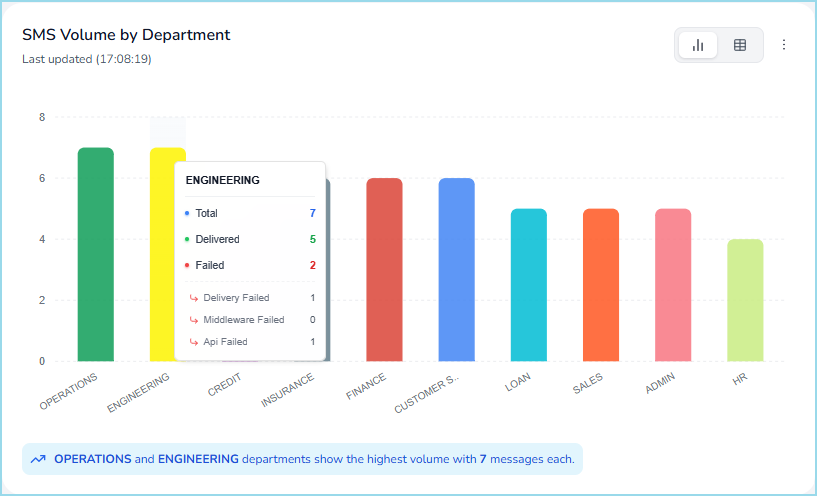{ width="600" }

    Hover over each bar to view the total number of messages sent, the number of messages delivered, and the number of messages that failed, along with failure reasons.

    ---

    ### SMS volume by service provider

    Shows the distribution of SMS messages across service providers for the current day.

    Shows provider-wise activity using a horizontal bar chart to compare traffic allocation and highlights the service provider that handled the highest traffic volume for the current day.

      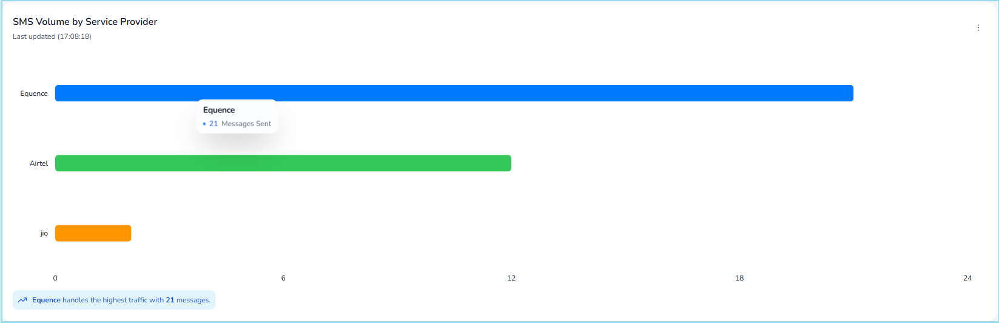{ width="800" }

    Hover over each bar to view the total number of messages processed by the selected provider.

    ---

    ### SMS volume by service type

    Shows the distribution of SMS messages by service type for the current day.

    Shows categorized activity using a stacked bar chart to understand how messaging traffic is distributed across different business communication categories.

      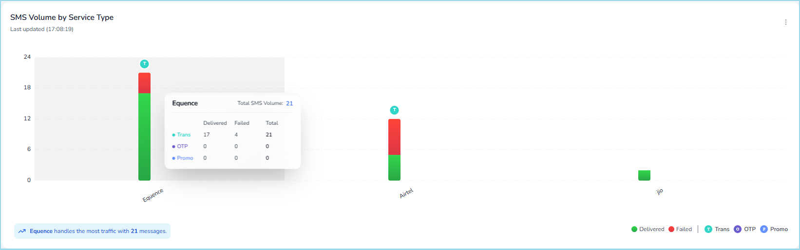{ width="800" }

    Hover over each segment to view the total number of messages sent, the number of messages delivered, and the number of messages that failed, along with failure reasons for each service type.

=== "Service Provider"

    **Service Provider** view has the following sections:

    ### Service provider status

    Shows the status of all configured service providers for the current day.

    Shows provider availability using a status list and highlights whether each provider is active or inactive.

      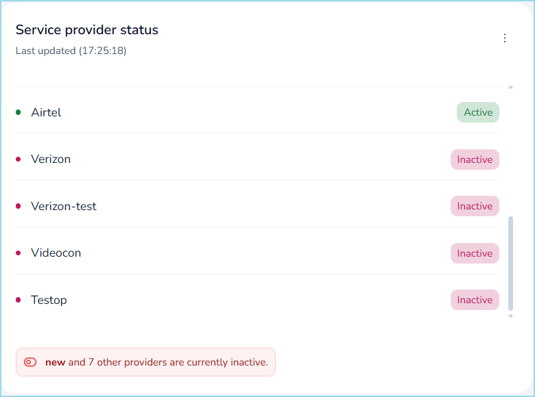{ width="500" }

    Helps users quickly identify inactive providers and monitor provider availability across the platform.

    ---

    ### Service provider traffic

    Shows the distribution of SMS traffic across service providers for the current day.

    Shows traffic share using a donut chart to represent relative contribution and highlights the service provider with the highest traffic share.

    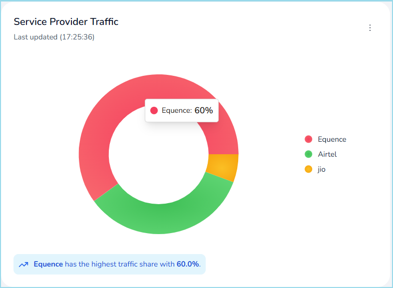{ width="500" }

    Hover over each segment to view the percentage and total traffic handled by the selected provider.

    ---

    ### Total API calls today

    Shows the total number of API calls processed by the platform for the current day.

    Shows API activity using a time-based chart and highlights the time at which peak API traffic was recorded today.

    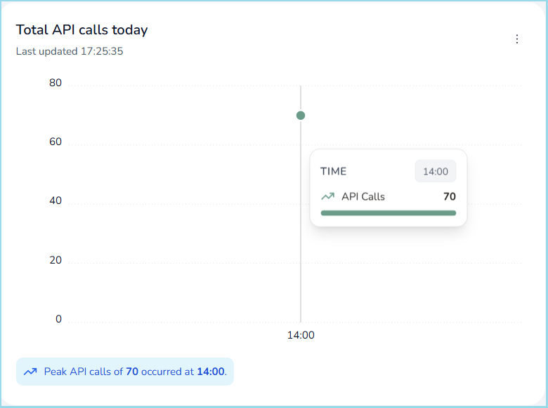{ width="500" }

    Hover over the chart to view the number of API calls processed at a specific time.

    ---

    ### Delivery reports received

    Shows the number of message sent and delivery reports received from service providers for the current day.

    Shows provider-wise delivery reports using a comparative bar chart to represent message acknowledgements.

    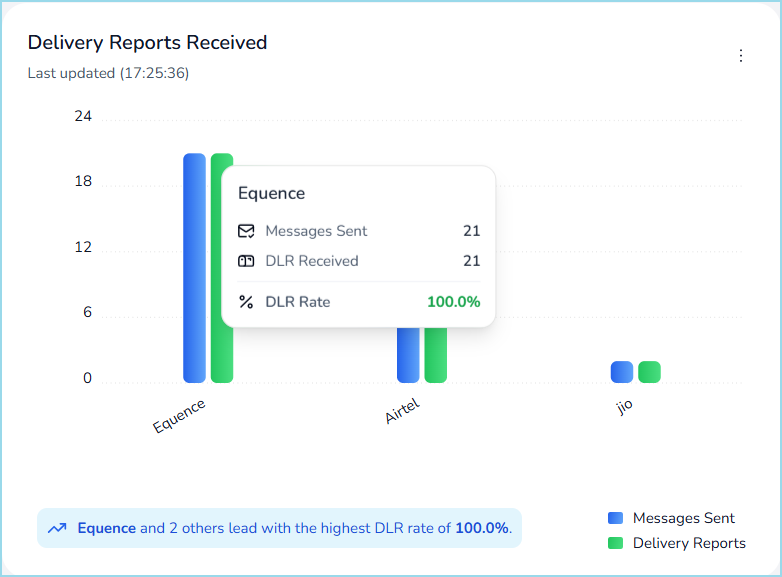{ width="500" }

    Hover over each bar to view the total number of message sent, delivery reports received, and delivery rate for the selected provider.

    ---

    ### Ongoing TPS by service provider

    Shows the current transactions per second (TPS) handled by each service provider.

    Shows real-time TPS activity and indicates live system throughput.

    Displays real-time status and may show no data when there is no active traffic.

    ---

    ### Avg latency by service provider

    Shows the average message processing latency for each service provider.

    Shows latency metrics to help evaluate provider responsiveness and performance.

    Displays real-time status and may show no data when latency data is not available.

    ---

    ### Successful deliveries today

    The **Successful Deliveries Today** pane includes two tabs: **Delivery by Number** and **Delivery by Percentage**.

    **Delivery by Number** shows the total number of successfully delivered messages for each service provider for the current day.

    **Delivery by Percentage** shows the delivery success rate, expressed as a percentage, for each service provider for the current day.

    Shows provider-wise delivery success using a horizontal bar chart and highlights the provider with the highest successful deliveries.

    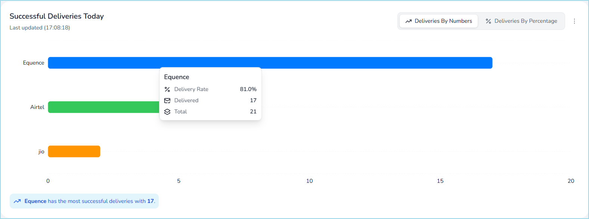{ width="800" }

    Hover over each bar to view the total number messages sent, the number of messages successfully delivered, and delivery rate for the selected provider.

    ---

    ### API calls by service provider today

    Shows the distribution of API calls across service providers for the current day.

    Shows categorized activity using a grouped bar chart to represent successful, retry, and failed API calls.

    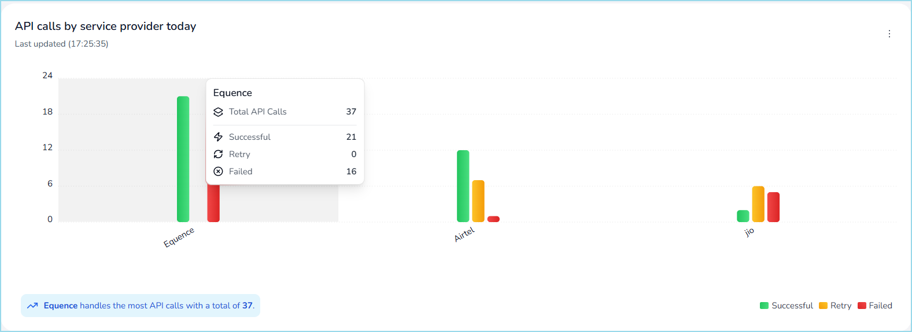{ width="800" }

    Hover over each bar to view the total number of API calls by status for the selected provider.

=== "System Health"

    **System Health** view has the following sections:

    ### Server statistics

    Shows infrastructure-level performance metrics for all servers for the current day.

    Shows server utilization using a tabular view that includes CPU usage, memory usage, thread count, disk utilization, and I/O activity, along with threshold status.

    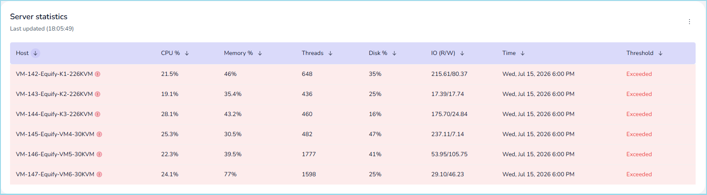{ width="800" }

    Helps users monitor server performance and identify resources that exceed defined thresholds.

    ---

    ### Network statistics

    Shows network-level performance metrics for all servers for the current day.

    Shows latency and component-level information using a tabular view, along with timestamp and threshold status.

    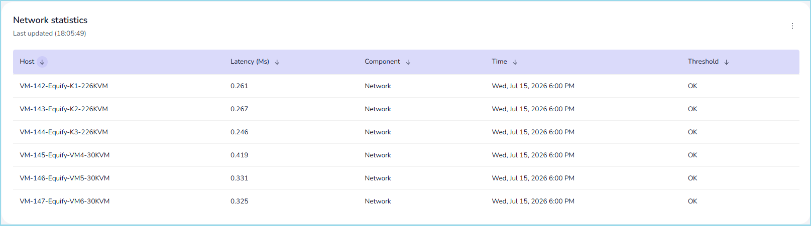{ width="800" }

    Helps users monitor network performance and identify latency or connectivity issues across the platform.

=== "Applications"

    **Applications** view has the following sections:

    ### Kafka

    Shows the operational status and resource utilization of Kafka components.

    Shows component-level activity using a tabular view, including CPU usage, memory usage, thread count, active connections, and heap memory consumption.

    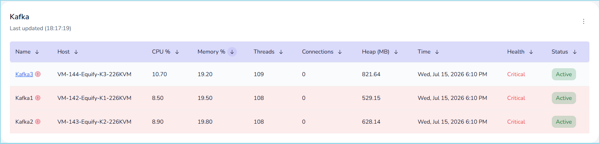{ width="800" }

    Highlights the health status of each Kafka instance and indicates whether it is operating within defined thresholds.

    Hover over each instance name to view heap usage details, including current heap consumption and configured limits.

    ---

    ### Database

    Shows the operational status and performance metrics of database systems.

    Shows database activity using a tabular view, including CPU usage, memory usage, active connections, and threshold status.

    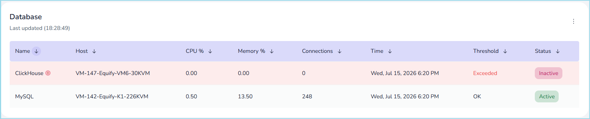{ width="800" }

    Highlights databases that exceed defined thresholds and indicates whether each database is active or inactive.

    Hover over each instance name to view error details.

    ---

    ### I/O Database

    Shows I/O-level activity and interaction counts for database components.

    Shows component-level I/O activity using a tabular view, including operation count, associated component, and execution time.

    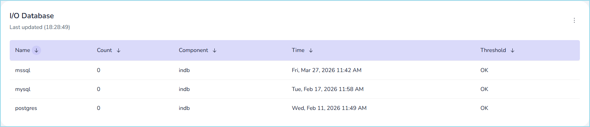{ width="800" }

    Highlights the operational status of each component based on defined thresholds.

    ---

    ### Redis

    Shows the operational status and resource utilization of Redis instances.

    Shows instance-level activity using a tabular view, including CPU usage, memory usage, and threshold status.

    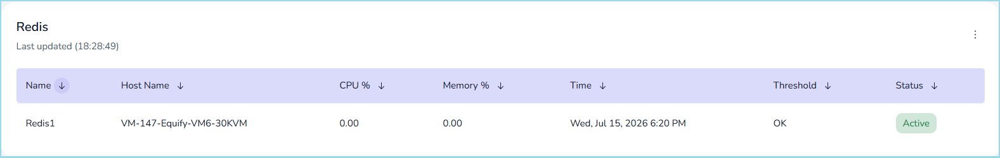{ width="800" }

    Highlights whether each Redis instance is active and operating within acceptable limits.

    ---

    ### Webserver

    Shows the operational status of web server services.

    Shows service-level activity using a tabular view, including host name, response status code, execution time, and threshold status.

    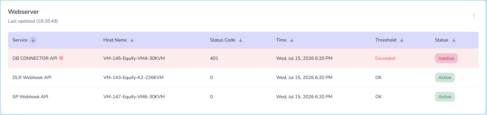{ width="800" }

    Highlights services that are inactive or have exceeded defined thresholds.

    Hover over each instance name to view error details.

    ---

    ### Applications

    Shows the operational status and performance metrics of application services.

    Shows application-level activity using a tabular view, including CPU usage, memory usage, thread count, and heap memory consumption.

    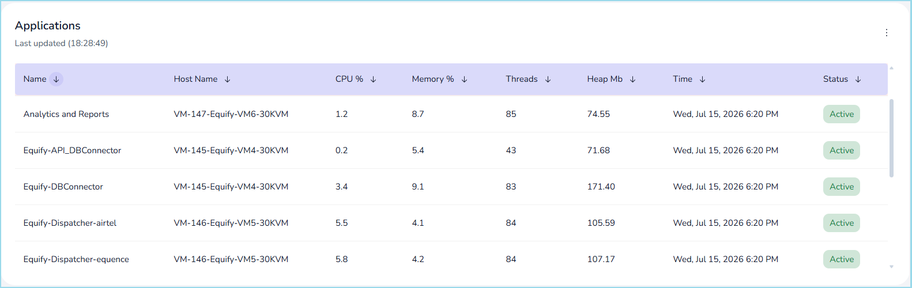{ width="800" }

    Highlights the status of each application service and indicates whether it is active or inactive.

    Hover over each instance name to view error details.

!!! tip "Refresh and export data"

    - Select **Refresh** to retrieve the latest dashboard data.
    - Select **More options (⋮)** on a pane, then choose **Refresh** to update that pane.
    - Select **More options (⋮)** on a pane, then choose **Export** to download the data in CSV format.

---

## What to do next

- Configure system components in [Control centre](../control-centre/index.md)
- Manage templates in [Template management](../template-management/add-template.md)
- Analyze system data in [Analytics](../analytics/index.md)

  

    <h2 class="support-title">Need some help?</h2>
    

      Communication at scale isn’t always simple. Get instant help from our
      <a href="https://equence.com/contact.html">support team</a>, or browse the
      <a href="faq/#faq">FAQ</a> for quick answers.
    

    

      <a href="https://equence.com/terms.html">Terms of service</a>
      <a href="https://equence.com/privacy-policy.html">Privacy Policy</a>
      © 2026 Equify. All rights reserved.
    

  

  

    

      
🎧

      
💬

      
🛡️

    

  

